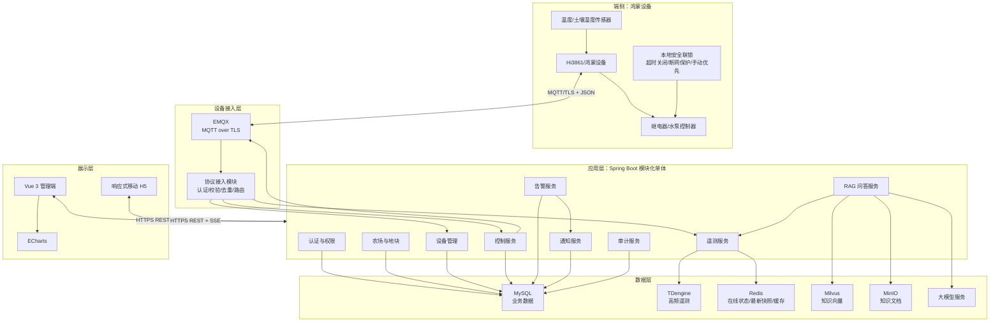
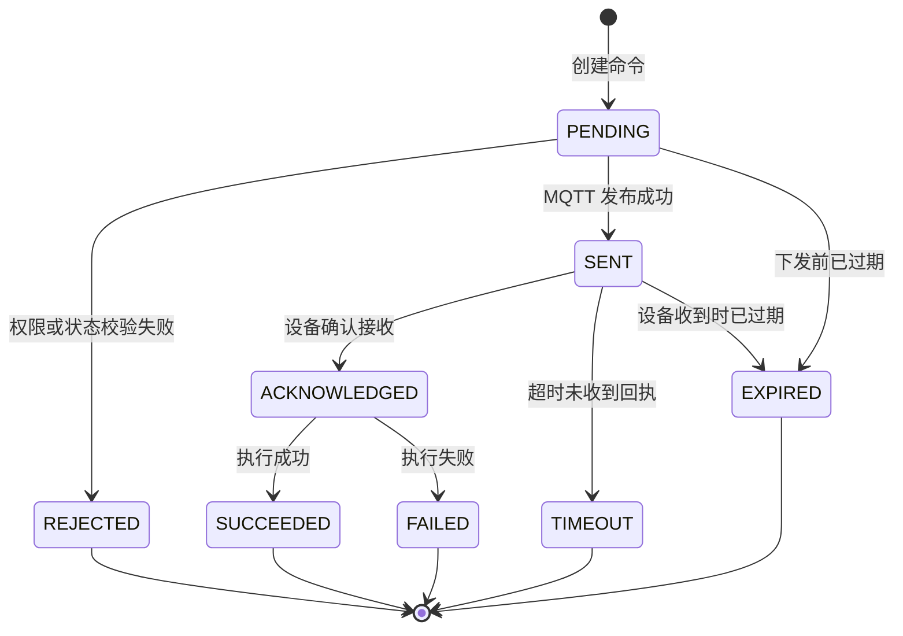
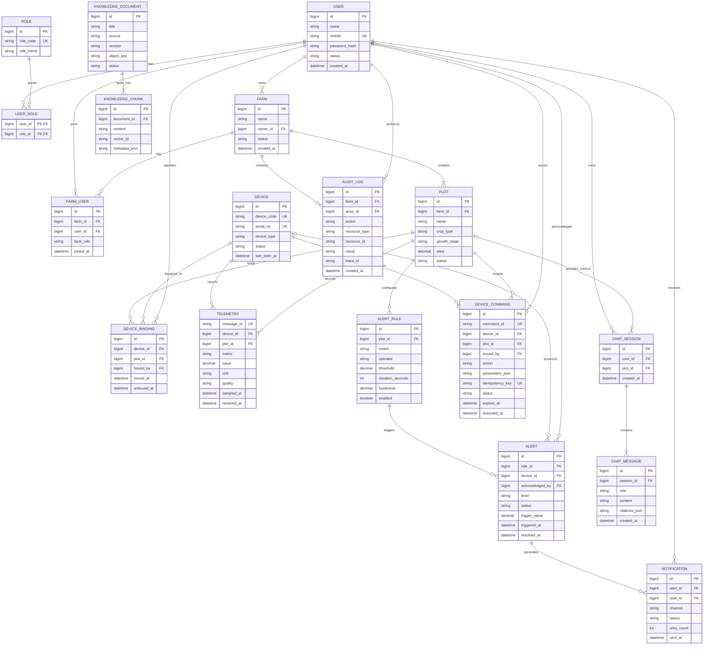
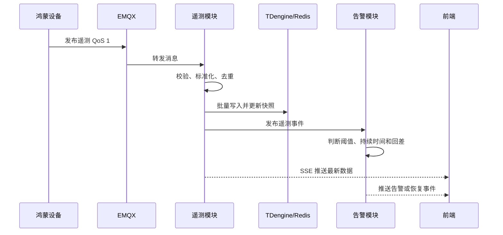
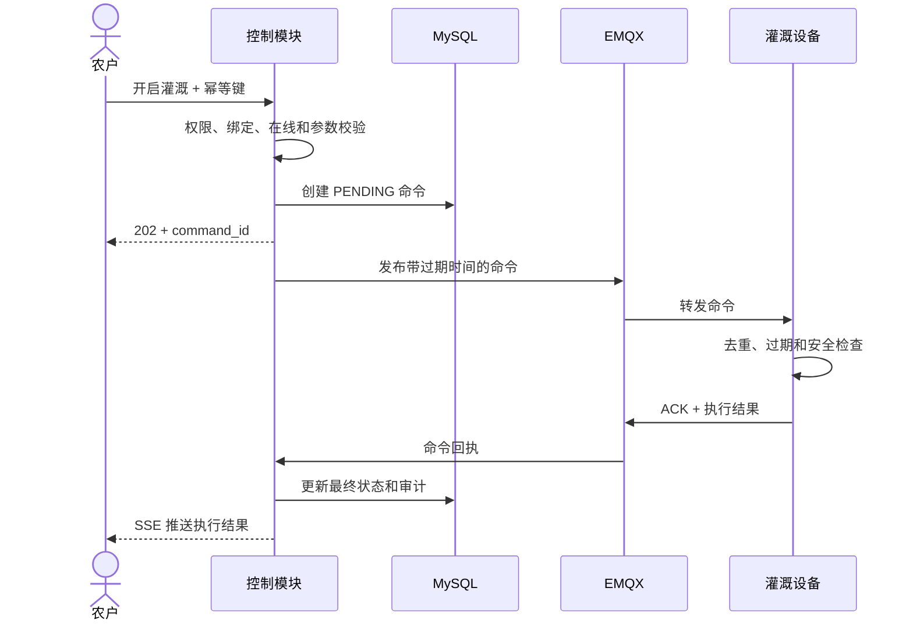
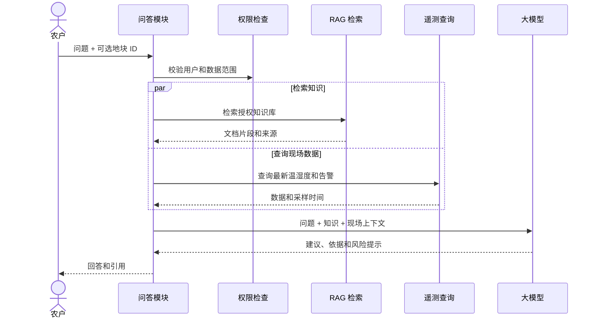
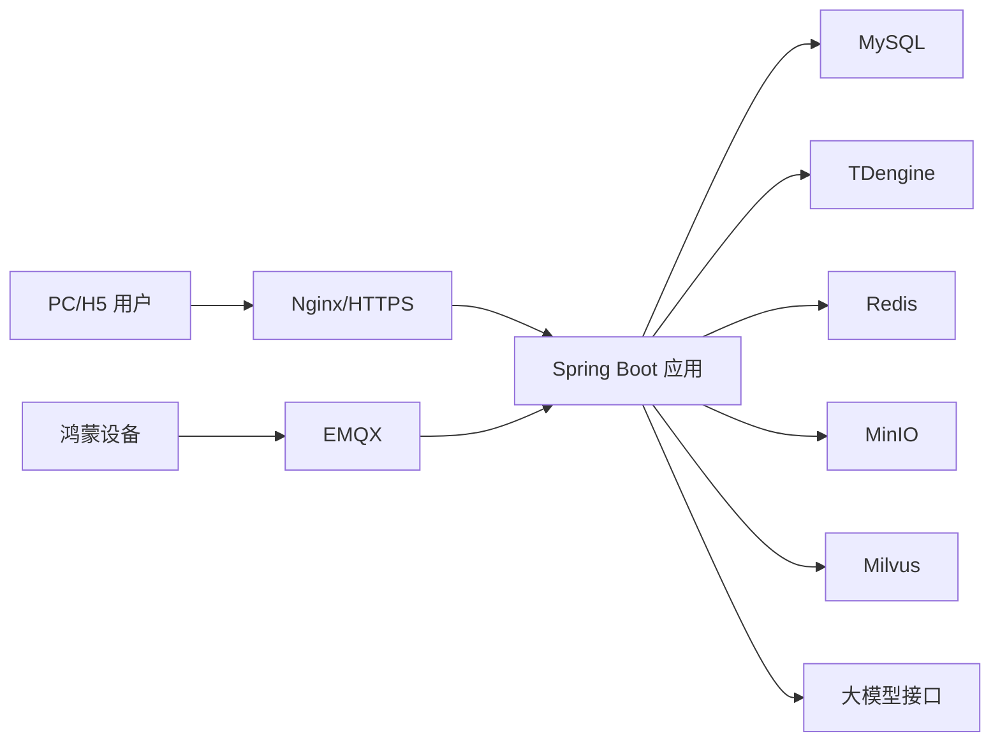

# 智慧农业系统架构设计（修订版）

> 文档版本：V1.1
> 文档状态：评审稿
> 适用范围：温室大棚环境监测、告警、远程灌溉、设备管理与灌溉智能问答
> 技术主线：鸿蒙端 + MQTT + Spring Boot + Vue 3 + MySQL/TDengine/Redis + RAG

## 1. 文档目的

本文档根据智慧农业基本功能清单，对系统边界、总体架构、模块职责、数据模型、设备协议、接口、安全、部署及演进路线进行定义，作为前端、后端、物联网固件、测试和运维开展详细设计的统一基线。

本版主要修订内容：

1. 将“Spring Boot 微服务”收敛为“Spring Boot 模块化单体起步”。
2. 明确首期技术选型，移除 Kafka/RabbitMQ/Redis Stream、WebSocket/SSE 等并列选项。
3. 将 MySQL 与遥测时序数据分离：MySQL 保存业务数据，TDengine 保存高频遥测。
4. 补充设备控制状态机、幂等、过期、顺序控制和端侧安全联锁。
5. 限制智能体首期只查询和建议，不允许直接控制设备。
6. 补充 ER 图、REST API、MQTT Topic、消息结构、安全、可观测性和验收标准。

## 2. 建设范围

### 2.1 首期功能

| 功能编号 | 角色 | 模块 | 功能 | 优先级 |
|---|---|---|---|---|
| 1-1 | 农户 | 数据监测 | 查看土壤湿度 | P0 |
| 1-2 | 农户 | 数据监测 | 查看温度 | P0 |
| 1-3 | 农户 | 数据监测 | 查看设备在线状态 | P0 |
| 2-1 | 农户 | 告警管理 | 设置土壤湿度阈值并接收告警 | P0 |
| 2-2 | 系统管理员 | 告警管理 | 查看告警日志 | P1 |
| 3-1 | 农户 | 设备控制 | 远程开启/关闭灌溉 | P0 |
| 4-1 | 农户 | 数据可视化 | 查看最近 7 天历史趋势 | P1 |
| 4-2 | 农场管理员 | 数据可视化 | 多地块总览 | P1 |
| 5-1 | 农场管理员 | 系统管理 | 设备绑定与解绑 | P1 |
| 6-1 | 农户 | 智能体 | 灌溉智能问答 | P2 |

### 2.2 非首期功能

- 根据阈值直接自动启动灌溉。
- 3D 数字孪生、实时地图、病虫害视觉识别和长势分析。
- 多智能体自主规划和未经用户确认的设备控制。
- 施肥、通风、补光等其他执行器控制。

## 3. 架构原则

| 原则 | 说明 |
|---|---|
| 安全优先 | 设备控制必须鉴权、幂等、可过期、可审计，并由端侧执行安全联锁 |
| 端云协同 | 云端负责业务规则和管理；端侧负责采集、执行、断网保护、最大运行时间等安全逻辑 |
| 模块化起步 | 首期采用 Spring Boot 模块化单体，保持领域边界，达到拆分条件后再服务化 |
| 事件解耦 | 遥测、告警和通知采用事件方式解耦；设备控制采用“同步受理、异步执行” |
| 数据分层 | 业务数据、实时快照和高频时序数据分别存储 |
| 权限隔离 | 农场是租户边界，地块和设备是数据授权边界 |
| 智能体受控 | 智能体首期只读业务数据，只提供建议，不直接操作物理设备 |
| 可追溯 | 遥测、告警、命令、通知和智能问答均携带关联标识并保留审计信息 |

## 4. 总体架构



## 5. 技术选型

### 5.1 首期基线

| 层次 | 选择 | 用途 |
|---|---|---|
| 端侧 | Hi3861/鸿蒙设备 | 传感器采集、执行器控制和本地安全保护 |
| 设备通信 | MQTT over TLS + JSON，QoS 1 | 遥测上报、心跳、命令和回执 |
| MQTT Broker | EMQX | 设备认证、Topic ACL、连接和消息路由 |
| 后端 | Spring Boot 模块化单体 | REST API、遥测、告警、控制和系统管理 |
| 前端 | Vue 3 + TypeScript + ECharts | PC 管理端和响应式移动页面 |
| 实时推送 | SSE | 最新遥测、设备状态、告警和命令结果推送 |
| 业务数据库 | MySQL | 用户、农场、地块、设备、告警、命令和审计 |
| 时序数据库 | TDengine | 高频温度、湿度遥测和时间聚合 |
| 缓存 | Redis | 设备在线状态、最新数据快照、限流和短期缓存 |
| 对象存储 | MinIO | RAG 原始知识文档 |
| 向量数据库 | Milvus | 知识文档切片向量检索 |
| 大模型 | OpenAI 兼容接口适配层 | 首期接入一种模型，避免业务代码绑定供应商 |
| 部署 | Docker Compose | 开发、演示和首期试点 |

### 5.2 暂不引入的组件

- 首期不引入 Kafka、RabbitMQ 或 Redis Stream。
- 模块内异步任务使用数据库 Outbox 表和后台任务执行器。
- 当遥测吞吐、独立扩容或跨服务事件需求达到瓶颈后，再评估 Kafka。
- 首期不同时支持 MQTT 和 CoAP，也不同时维护 JSON 和 Protobuf 两套协议。

## 6. 应用模块设计

### 6.1 认证与权限模块

- 用户登录、访问令牌和刷新令牌管理。
- RBAC 功能权限与农场/地块数据权限结合。
- 角色包括农户、农场管理员和系统管理员。
- 控制、阈值修改、设备绑定和权限修改必须写入审计日志。

| 操作 | 农户 | 农场管理员 | 系统管理员 |
|---|---:|---:|---:|
| 查看授权地块数据 | 是 | 是 | 是 |
| 控制授权地块设备 | 是 | 是 | 需显式授权 |
| 设置授权地块阈值 | 是 | 是 | 需显式授权 |
| 查看农场全部地块 | 否 | 是 | 是 |
| 绑定和解绑设备 | 否 | 是 | 是 |
| 查看全系统告警和审计 | 否 | 否 | 是 |

### 6.2 农场与地块模块

- 维护农场、地块、作物类型、生长阶段和面积。
- 农场作为租户隔离边界。
- 一个农场包含多个地块，一个地块可绑定多个传感器和执行器。

### 6.3 设备管理模块

- 设备注册、激活、禁用、绑定和解绑。
- 每台设备使用独立密钥或证书，禁止生产设备共享密钥。
- 结合 EMQX 连接事件、Last Will 和设备心跳判断在线状态。
- 默认连续 3 个心跳周期未收到消息即判定离线，具体周期配置化。
- 解绑仅终止绑定关系，不删除历史遥测和命令记录。

设备状态：`UNACTIVATED`、`ONLINE`、`OFFLINE`、`FAULT`、`DISABLED`。

### 6.4 遥测模块

处理流程：

1. 消费 EMQX 转发的遥测消息。
2. 校验设备身份、Topic、Schema、时间戳、指标和值域。
3. 使用 `device_id + message_id` 去重。
4. 批量写入 TDengine，避免每条消息单独提交。
5. 更新 Redis 中的设备最新状态和地块数据快照。
6. 发布模块内遥测事件，触发阈值判断和 SSE 推送。

### 6.5 控制模块

- REST 接口同步校验并创建命令，返回 `202 Accepted`。
- 命令必须先持久化，再通过 MQTT 下发。
- 同一设备的控制命令串行处理，避免开关指令乱序。
- 设备离线时默认拒绝控制，不无限期缓存危险命令。
- 命令携带过期时间；过期命令即使送达也不得执行。
- 端侧根据 `command_id` 去重，并实施最大灌溉时长和断网保护。



`TIMEOUT` 表示结果未知，不能简单等同于失败并自动重复执行。

### 6.6 告警模块

为避免阈值附近抖动造成告警风暴，规则包含持续时间和恢复回差：

- 触发示例：土壤湿度低于 30%，并持续 2 分钟。
- 恢复示例：土壤湿度达到 33%，并持续 2 分钟。
- 同一规则存在活动告警时不重复创建，仅更新最近发生时间。
- 告警状态：`ACTIVE`、`ACKNOWLEDGED`、`RESOLVED`、`CLOSED`。
- 告警生成与通知解耦，通知失败不影响告警持久化。

### 6.7 智能问答模块

- 对知识文档执行解析、切片、向量化和检索。
- 根据用户问题查询授权地块的最新湿度、温度和告警。
- 回答包含知识来源和现场数据采样时间。
- 明确区分知识库内容、现场数据和模型推断。
- 首期不向智能体开放设备控制工具。
- 用户要求灌溉时，智能体只生成建议，引导用户进入正式控制页面确认。

## 7. 核心数据模型



说明：`TELEMETRY` 为 TDengine 逻辑实体，其他核心业务实体保存在 MySQL；Redis 中的在线状态和最新数据属于可重建缓存，不作为业务事实的唯一来源。

## 8. 数据存储与容量设计

### 8.1 数据分层

| 数据 | 存储 | 策略 |
|---|---|---|
| 用户、农场、地块、设备绑定 | MySQL | 事务一致性、长期保留 |
| 告警、命令、通知、审计 | MySQL | 可追溯、按时间归档 |
| 温度、湿度原始遥测 | TDengine | 批量写入、时间分区、保留策略 |
| 设备最新状态和最新遥测 | Redis | 设置 TTL，可从时序库和心跳重建 |
| 5 分钟、小时和天聚合 | TDengine | 用于趋势图和统计分析 |
| 知识文档 | MinIO | 原文、版本和来源 |
| 文档向量 | Milvus | 按知识库权限过滤 |

### 8.2 容量计算

遥测行数估算公式：

```text
每日遥测行数 = 设备数 × 每台指标数 × 86400 ÷ 上报间隔秒数
```

示例：1,000 台设备、每台 2 个指标、每 10 秒上报一次，将产生约 1,728 万行/天。因此 MySQL 不承担长期高频原始遥测，只保存业务数据。

### 8.3 保留策略

- 原始遥测默认保留 90 天。
- 5 分钟聚合默认保留 1 年。
- 日聚合根据业务要求长期保留。
- 保留周期必须配置化，并在生产上线前结合设备规模重新评估。
- 历史趋势接口根据查询跨度选择原始或聚合数据，限制最大返回点数。

## 9. MQTT 协议设计

### 9.1 Topic

| 方向 | Topic | QoS | 用途 |
|---|---|---:|---|
| 设备→平台 | `agri/v1/devices/{deviceId}/telemetry` | 1 | 遥测上报 |
| 设备→平台 | `agri/v1/devices/{deviceId}/heartbeat` | 1 | 心跳和运行状态 |
| 平台→设备 | `agri/v1/devices/{deviceId}/commands` | 1 | 控制命令 |
| 设备→平台 | `agri/v1/devices/{deviceId}/command-acks` | 1 | 命令回执 |
| 设备→平台 | `agri/v1/devices/{deviceId}/events` | 1 | 故障和重启事件 |

EMQX ACL 必须保证设备只能发布或订阅自身 `deviceId` 对应的 Topic。

### 9.2 遥测消息

```json
{
  "schema_version": "1.0",
  "message_id": "01J5X8M8B9J4M8R7AZ8R1R6C3Q",
  "device_id": "dev_10001",
  "timestamp": "2026-08-21T08:00:00Z",
  "metrics": {
    "soil_moisture": { "value": 28.6, "unit": "%", "quality": "GOOD" },
    "temperature": { "value": 26.4, "unit": "C", "quality": "GOOD" }
  }
}
```

### 9.3 控制命令

```json
{
  "schema_version": "1.0",
  "command_id": "cmd_01J5X8M8",
  "action": "IRRIGATION_ON",
  "parameters": { "duration_seconds": 600 },
  "issued_at": "2026-08-21T08:01:00Z",
  "expires_at": "2026-08-21T08:01:30Z"
}
```

### 9.4 命令回执

```json
{
  "command_id": "cmd_01J5X8M8",
  "device_id": "dev_10001",
  "status": "SUCCEEDED",
  "executed_at": "2026-08-21T08:01:02Z",
  "reported_state": { "irrigation": "ON" },
  "error_code": null,
  "error_message": null
}
```

## 10. REST API 与实时事件

统一前缀：`/api/v1`。时间使用 ISO 8601，响应包含 `request_id`。

| 方法 | 路径 | 说明 |
|---|---|---|
| `POST` | `/auth/login` | 用户登录 |
| `GET` | `/farms/{farmId}/overview` | 多地块总览 |
| `GET` | `/plots/{plotId}/telemetry/latest` | 查询最新温湿度 |
| `GET` | `/plots/{plotId}/telemetry/history` | 查询历史趋势 |
| `GET` | `/devices/{deviceId}` | 查询设备和在线状态 |
| `POST` | `/devices/{deviceId}/commands` | 创建灌溉控制命令 |
| `GET` | `/commands/{commandId}` | 查询命令状态 |
| `PUT` | `/plots/{plotId}/alert-rules/{ruleId}` | 设置阈值规则 |
| `GET` | `/farms/{farmId}/alerts` | 查询告警日志 |
| `POST` | `/alerts/{alertId}/acknowledge` | 确认告警 |
| `POST` | `/plots/{plotId}/devices:bind` | 绑定设备 |
| `POST` | `/plots/{plotId}/devices:unbind` | 解绑设备 |
| `POST` | `/agent/chat` | 智能问答 |
| `GET` | `/events?farm_id={farmId}` | SSE 实时事件流 |

SSE 事件类型：`telemetry.updated`、`device.status_changed`、`alert.triggered`、`alert.resolved`、`command.status_changed`。

客户端断线重连后重新获取最新快照，不依赖 SSE 补齐所有历史事件。

## 11. 核心业务流程

### 11.1 遥测上报与告警



### 11.2 远程灌溉



### 11.3 智能问答



## 12. 安全设计

### 12.1 用户与 API 安全

- 全链路 HTTPS，访问令牌短期有效，刷新令牌可撤销。
- 密码使用安全哈希算法保存，密钥不进入代码仓库。
- 服务端统一注入农场和地块数据范围，禁止依赖前端过滤。
- 控制接口实施权限校验、限流、幂等和防重放。
- 控制、设备绑定、阈值修改和权限修改全部审计。

### 12.2 设备安全

- MQTT 使用 TLS，生产环境禁止匿名连接。
- 每台设备使用独立凭据，支持轮换、吊销和禁用。
- Broker 按 `deviceId` 配置 Topic ACL。
- 命令携带唯一 ID、签发时间和过期时间。
- 端侧具备最大灌溉时间、断网保护和手动控制优先级。

### 12.3 智能体安全

- 检索前按用户、农场和知识库权限过滤。
- 防止提示注入、越权检索和敏感信息泄漏。
- 首期不给大模型设备控制能力。
- 保存模型版本、引用片段、安全拦截结果和响应耗时。

## 13. 非功能需求

以下是试点阶段基线，实施前根据设备数和上报频率复核：

| 指标 | 目标 |
|---|---|
| 在线设备 | 1,000 台，可水平扩展 |
| 遥测持续写入 | 200 条/秒，峰值 1,000 条/秒 |
| 实时数据端到端延迟 | P95 小于 3 秒 |
| 普通 API 响应 | P95 小于 500 毫秒 |
| 最近 7 天趋势查询 | P95 小于 2 秒，结果降采样 |
| 控制命令平台下发 | P95 小于 1 秒，不含端侧执行时间 |
| 试点可用性 | 不低于 99.5% |

可靠性要求：

- MQTT QoS 1 只保证至少一次投递，业务层必须去重。
- MySQL 定期全量备份并执行增量日志归档。
- TDengine 按保留策略管理原始数据并定期备份关键聚合数据。
- 数据库 Outbox 保证告警通知等异步任务不因进程重启丢失。
- 设备断网时允许有限遥测缓存，恢复后按原采样时间补传。

## 14. 可观测性

统一传播 `trace_id`、`request_id`、`message_id` 和 `command_id`。

关键监控指标：

- EMQX 连接数、上下行吞吐、认证失败和断开原因。
- 遥测消费延迟、校验失败、重复消息和批量写入失败。
- 在线/离线设备数和心跳超时数。
- 活动告警数、告警恢复时间和通知成功率。
- 命令成功率、失败率、超时率和执行耗时。
- MySQL、TDengine 和 Redis 的容量、延迟和错误率。
- RAG 检索耗时、模型耗时、引用命中和安全拦截次数。

## 15. 部署架构



### 15.1 环境划分

- `dev`：开发联调，可使用设备模拟器。
- `test`：自动化测试和 MQTT 协议兼容测试。
- `staging`：端到端验收，配置接近生产。
- `prod`：生产环境，使用独立密钥和持久化存储。

### 15.2 单机试点约束

- Docker Compose 服务均配置持久化卷。
- 数据库备份保存到独立介质，不能只保存在同一服务器。
- 密钥通过环境变量或密钥文件挂载，不写入镜像和仓库。
- 定期执行恢复演练。
- 规模扩大后优先拆分数据库和 EMQX，再按负载扩展应用实例。

## 16. 测试策略

- 单元测试：权限、阈值和回差、命令状态机、去重和参数校验。
- 协议测试：MQTT Topic、消息 Schema、异常值和版本兼容。
- 集成测试：EMQX、MySQL、TDengine、Redis、MinIO 和 Milvus。
- 端到端测试：遥测上报到页面、低湿告警、控制下发和执行回执。
- 异常测试：重复/乱序消息、设备离线、回执丢失、过期命令和 Broker 重连。
- 安全测试：跨农场越权、Topic 越权、命令重放、提示注入和敏感信息泄漏。
- 性能测试：批量设备连接、峰值写入、历史查询和多地块并发访问。

## 17. 实施阶段

### 阶段一：设备接入与监测闭环

- 用户、农场、地块和设备基础模型。
- EMQX 接入、设备认证、遥测上报和在线状态。
- TDengine 批量写入、Redis 最新快照和实时展示。
- 设备模拟器和协议测试。

### 阶段二：告警与控制闭环

- 阈值、持续时间、恢复回差和告警日志。
- 站内通知。
- 灌溉命令、幂等、过期、回执、审计和端侧安全策略。

### 阶段三：趋势与运营管理

- 最近 7 天趋势和时间聚合。
- 多地块总览。
- 设备绑定、解绑和管理页面。
- 监控、备份和恢复演练。

### 阶段四：智能问答

- 知识文档入库、切片、向量化和检索。
- 结合授权地块现场数据生成建议。
- 引用来源、安全拦截和人工评测。

## 18. 架构决策记录

| 决策 | 首期选择 | 原因 | 演进条件 |
|---|---|---|---|
| 服务形态 | Spring Boot 模块化单体 | 降低首期分布式开发和运维复杂度 | 模块吞吐、发布节奏或团队边界独立时拆分 |
| 遥测存储 | TDengine | 高频 IoT 时序写入和时间聚合更合适 | 无需迁移，按设备规模扩容 |
| 业务存储 | MySQL | 事务模型和团队技术栈成熟 | 按容量进行读写扩展和归档 |
| 实时推送 | SSE | 当前主要为服务端单向推送 | 出现大量双向实时交互后改用 WebSocket |
| 内部消息 | Outbox + 后台任务 | 首期无需额外消息集群 | 跨服务事件量显著增长后引入 Kafka |
| 智能体 | 单 RAG 问答 | 当前场景单一，多智能体收益不足 | 工具和复杂工作流显著增加后评估多智能体 |
| 设备控制 | 用户确认后执行 | 避免模型或规则误判导致物理损失 | 自动控制须另行完成安全评审和联锁验证 |

## 19. 风险与待确认事项

| 编号 | 事项 | 影响 | 处理建议 |
|---|---|---|---|
| R1 | 目标设备数和上报频率未明确 | 影响 TDengine、EMQX 和网络容量 | 开发前完成容量测算和峰值压测 |
| R2 | 鸿蒙设备型号和资源约束未确认 | 影响 TLS、JSON解析和离线缓存 | 尽早完成真实硬件验证 |
| R3 | 灌溉控制器安全联锁能力未知 | 影响远程控制安全 | 必须实现最大运行时间和本地手动优先 |
| R4 | 阈值范围和配置权限未确认 | 影响规则和权限模型 | 定义管理员推荐值及农户可调范围 |
| R5 | 外部通知渠道未确定 | 影响费用和第三方集成 | 首期仅站内通知，预留适配接口 |
| R6 | 农业知识来源和版权未确认 | 影响 RAG 质量和合规 | 建立来源、版本、授权和审核记录 |
| R7 | 数据保留要求未确认 | 影响存储成本和合规 | 上线前确认原始与聚合数据保留期 |

## 20. 验收追踪矩阵

| 用户故事 | 承载模块 | 关键验收点 |
|---|---|---|
| 查看土壤湿度和温度 | 遥测、TDengine、Redis、SSE | 数值、单位、质量、采样时间和设备状态正确 |
| 查看历史趋势 | 时序查询、聚合、ECharts | 最近 7 天数据准确，缺失数据可识别 |
| 远程控制灌溉 | 控制、EMQX、命令状态机、审计 | 幂等、过期、回执和最终状态完整 |
| 设置湿度阈值 | 告警、通知 | 持续时间和恢复回差有效，无告警风暴 |
| 查看设备状态 | 心跳、Last Will、Redis | 在线/离线判断及时且可解释 |
| 灌溉智能问答 | RAG、授权数据查询、大模型 | 有来源、有数据时间、不越权、不直接控制 |
| 多地块总览 | 农场、地块、聚合查询 | 仅展示授权地块，状态和告警数准确 |
| 设备绑定管理 | 设备、绑定关系、权限、审计 | 绑定和解绑可追溯，历史数据不丢失 |
| 查看告警日志 | 告警查询、RBAC | 支持筛选并正确隔离不同农场数据 |

---

进入详细设计前，必须先确认设备型号、目标设备规模、指标数量、上报频率、控制器安全能力和数据保留周期，再据此确定服务器规格、TDengine 分片策略和性能测试基线。
