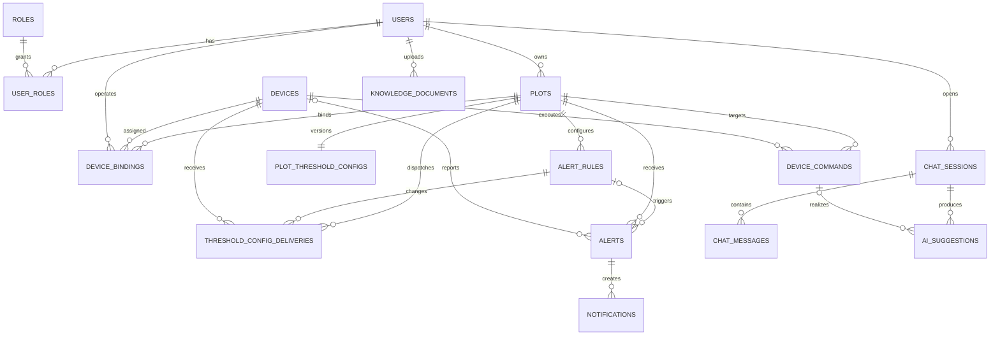

# 智慧农业 Go 服务数据库现状

## 1. 文档范围

本文记录当前 Go 服务实际使用的数据存储、MySQL 表、主要表关系和 Redis 数据。内容以 2026-08-24 的本地数据库实例、`backend/internal/platform/database/migrations` 迁移文件及当前代码为准。

当前 MySQL 已应用到 `017_create_order_intents.sql`。数据库结构发生变化后，应同步更新本文。

## 2. 数据存储总览

| 存储 | 默认位置 | 当前用途 | 是否保存业务事实 |
| --- | --- | --- | --- |
| MySQL 8.4 | `localhost:3307/smart_agriculture` | 用户、地块、设备、告警、命令、通知、会话、知识文档元数据、审计和 Outbox | 是 |
| Redis 8.4 | `redis://localhost:6379/0` | 查询缓存、最新遥测、设备活跃时间、灌溉状态快照 | 否，属于可过期或可重建数据 |
| MinIO | `localhost:9000`，默认 Bucket 为 `knowledge` | 保存知识文档原始文件；文件元数据仍在 MySQL | 保存文件对象 |
| TDengine | 尚未接入 | 计划保存历史遥测 | 当前不保存数据 |
| Go 进程内存 | 当前进程 | SSE 订阅和最近 512 条事件重放 | 否，进程退出后丢失 |

## 3. MySQL 表清单

当前 `smart_agriculture` 数据库共有 24 张表，其中 22 张业务表、2 张迁移元数据表。

### 3.1 用户与权限

| 表 | 用途 | 关键字段 | 主要关系或约束 |
| --- | --- | --- | --- |
| `users` | 用户账户和偏好 | `id`、`name`、`mobile`、`password_hash`、`status`、`interaction_style`、`knowledge_reliance` | `name`、`mobile` 唯一；其他业务表通过用户 ID 关联 |
| `roles` | 角色字典 | `id`、`role_code`、`role_name` | `role_code` 唯一 |
| `user_roles` | 用户与角色多对多关系 | `user_id`、`role_id` | 联合主键；分别外键关联 `users`、`roles` |

迁移定义的预置角色为 `FARMER`、`FARM_ADMIN`、`SYSTEM_ADMIN`、`WAREHOUSE_MANAGER`（015）、`CUSTOMER`（017）。2026-08-24 本地实例实际只有 `FARMER` 和 `SYSTEM_ADMIN`，缺少 `FARM_ADMIN`，属于种子数据与迁移定义不一致，后续应补齐或确认该角色是否废弃。

### 3.2 地块、设备与控制

| 表 | 用途 | 关键字段 | 主要关系或约束 |
| --- | --- | --- | --- |
| `plots` | 用户拥有的地块 | `id`、`owner_id`、`code`、`name`、`crop_type`、`planting_time`、`growth_stage`、`area`、`location`、`status` | `owner_id -> users.id`；用户与地块是一对多 |
| `devices` | 设备主数据 | `id`、`device_code`、`serial_no`、`name`、`device_type`、`model`、`status`、`battery`、`signal`、`firmware_version`、`last_seen_at` | `device_code`、`serial_no` 唯一 |
| `device_bindings` | 设备与地块的绑定历史 | `id`、`device_id`、`plot_id`、`bound_by`、`bound_at`、`unbound_at` | 分别关联 `devices`、`plots`、`users`；`unbound_at IS NULL` 表示当前绑定 |
| `device_commands` | 设备控制命令及执行结果 | `id`、`command_id`、`device_id`、`plot_id`、`issued_by`、`action`、`parameters_json`、`idempotency_key`、`status`、执行时间和错误信息 | `command_id`、`idempotency_key` 唯一；关联设备、地块和发起用户 |

早期版本中的 `farms` 和 `farm_users` 已由 `004_flatten_farms_to_plot_owners.sql` 删除。当前归属模型是 `users -> plots`，不要再基于农场中间层新增查询或外键。

### 3.3 告警、通知与可靠事件

| 表 | 用途 | 关键字段 | 主要关系或约束 |
| --- | --- | --- | --- |
| `alert_rules` | 地块告警规则 | `id`、`plot_id`、`metric`、`comparison_operator`、`threshold`、`duration_seconds`、`hysteresis`、`level`、`enabled` | `plot_id -> plots.id` |
| `plot_threshold_configs` | 地块阈值配置版本 | `plot_id`、`config_version` | 每个地块一行；版本单调递增 |
| `threshold_config_deliveries` | 阈值快照逐设备投递状态 | `message_id`、`plot_id`、`changed_rule_id`、`device_id`、`config_version`、`status`、发送/ACK/超时时间和错误 | 消息 ID 唯一；同一地块、设备、版本唯一 |
| `alerts` | 规则或设备警告产生的告警记录 | `id`、`rule_id`、`plot_id`、`device_id`、`source`、`warning_type`、`active_dedup_key`、`level`、`status`、触发/确认/恢复时间 | `plot_id` 必填；`rule_id`、`device_id` 可空；活动去重键唯一；确认用户关联 `users` |
| `notifications` | 面向用户的告警通知 | `id`、`alert_id`、`user_id`、`channel`、`content`、`status`、`retry_count`、`sent_at` | 关联 `alerts` 和 `users` |
| `audit_logs` | 重要操作的审计记录 | `id`、`actor_id`、`action`、`resource_type`、`resource_id`、`result`、`request_id`、`trace_id` | `actor_id` 可空并关联 `users`；支持按 `trace_id` 追踪 |
| `outbox_events` | 事务内可靠事件 | `id`、`aggregate_type`、`aggregate_id`、`event_type`、`payload`、`status`、`available_at`、`published_at`、`retry_count`、`last_error` | 与业务写入同事务落库，后台派发器异步处理 |

### 3.4 仓储与意向订单

| 表 | 用途 | 关键字段 | 主要关系或约束 |
| --- | --- | --- | --- |
| `materials` | 农产品/农资物料主数据 | `id`、`name`、`category`、`unit`、`spec`、`status` | `name` 唯一；`status` 支持软删除（DELETED） |
| `warehouses` | 成品仓主数据 | `id`、`name`、`location`、`status` | `name` 唯一 |
| `stocks` | 实物库存 | `id`、`warehouse_id`、`material_id`、`quantity`、`status` | `(warehouse_id, material_id)` 联合唯一；`quantity >= 0` 检查约束 |
| `stock_records` | 出入库流水 | `id`、`warehouse_id`、`material_id`、`type(IN/OUT)`、`quantity`、`ref_type(HARVEST/ORDER/ADJUSTMENT)`、`ref_id`、`plot_id`、`operator_id`、`remark` | `quantity > 0` 检查约束；`(ref_type, ref_id, warehouse_id, material_id)` 业务引用唯一 |
| `order_headers` | 采购意向单主表 | `id`、`order_no`、`status(PENDING/APPROVED/TRADING/CONFIRMED/CLOSED/REJECTED/DELETED)`、`customer_id`、`expected_time`、`remark` | `order_no` 唯一；`customer_id -> users.id` |
| `order_items` | 意向单明细 | `id`、`order_id`、`material_id`、`quantity`、`warehouse_id`（成交时指定） | `(order_id, material_id)` 联合唯一；`quantity > 0` 检查约束 |

- 全链路**无价格字段**：意向、成交、库存、流水不出现价格。
- **可售数量**（占用量）由仓储 Service 统一输出：`available = Σstocks − Σ(TRADING 状态 order_items)`，`ReservationReader` 由订单模块实现注入。
- 数量统一 `DECIMAL(18,3)`，单位取 `materials.unit`（不重复存储）。

### 3.5 会话、建议与知识文档

| 表 | 用途 | 关键字段 | 主要关系或约束 |
| --- | --- | --- | --- |
| `chat_sessions` | 用户会话 | `id`、`user_id`、`plot_id`、`status`、`summary`、`last_message_at`、`closed_at` | 关联用户；可选关联地块 |
| `chat_messages` | 会话消息 | `id`、`session_id`、`role`、`content`、`citations_json`、`plot_id`、`model_version`、`trace_id`、`prompt_tokens`、`completion_tokens` | 关联会话；可选关联地块；`prompt_tokens`/`completion_tokens` 记录该条 ASSISTANT 消息对应的 LLM token 消耗（015 迁移新增） |
| `ai_suggestions` | 会话产生的业务建议及采纳状态 | `id`、`session_id`、`plot_id`、`action`、`duration_seconds`、`confidence`、`reason`、`status`、`accepted_by`、`command_id` | 关联会话、地块、采纳用户和可选设备命令 |
| `knowledge_documents` | 知识文档元数据和发布状态 | `id`、`title`、`category`、`object_key`、`file_hash`、`source`、`status`、`version`、上传/审批/发布/归档信息 | `file_hash` 唯一；上传人与审批人关联 `users`；文件内容位于 MinIO |

这些表属于 Go 服务的数据管理范围。外部智能体可以通过受保护接口写入消息或接收通知，但不直接拥有或迁移这些 MySQL 表。

### 3.6 迁移元数据

| 表 | 用途 |
| --- | --- |
| `schema_migrations` | 当前 Go 内嵌迁移器记录已应用的 SQL 文件，现有版本为 001 至 017 |
| `flyway_schema_history` | 兼容旧 Flyway 数据库的历史记录；Go 迁移器会导入成功版本，避免重复执行 |

## 4. MySQL 字段明细

本节是当前最终结构的字段级数据字典。`默认值` 中的 `—` 表示没有数据库默认值，调用方或 Repository 必须显式赋值；`NULL` 表示该字段允许为空且默认可为空。

### 4.1 `users`：用户账户

| 字段 | 类型 | 可空 | 默认值 | 键与约束 | 业务含义 |
| --- | --- | --- | --- | --- | --- |
| `id` | `BIGINT` | 否 | 自增 | 主键 | 用户内部数字 ID，也是 JWT 中的用户标识 |
| `name` | `VARCHAR(64)` | 否 | — | 唯一键 `uk_users_name` | 登录用户名/账户名 |
| `mobile` | `VARCHAR(32)` | 否 | — | 唯一键 `uk_users_mobile` | 用户手机号 |
| `password_hash` | `VARCHAR(255)` | 否 | — | — | bcrypt 密码哈希，不保存明文密码 |
| `status` | `VARCHAR(32)` | 否 | — | — | 账户状态，例如启用或禁用 |
| `interaction_style` | `VARCHAR(16)` | 是 | `NULL` | — | 交互风格偏好 |
| `knowledge_reliance` | `VARCHAR(16)` | 是 | `NULL` | — | 知识依赖程度偏好 |
| `created_at` | `DATETIME(6)` | 否 | `CURRENT_TIMESTAMP(6)` | — | 创建时间 |
| `updated_at` | `DATETIME(6)` | 否 | `CURRENT_TIMESTAMP(6)` | `ON UPDATE CURRENT_TIMESTAMP(6)` | 最后更新时间 |

### 4.2 `roles`：角色字典

| 字段 | 类型 | 可空 | 默认值 | 键与约束 | 业务含义 |
| --- | --- | --- | --- | --- | --- |
| `id` | `BIGINT` | 否 | 自增 | 主键 | 角色内部 ID |
| `role_code` | `VARCHAR(64)` | 否 | — | 唯一键 `uk_roles_code` | 程序使用的角色编码 |
| `role_name` | `VARCHAR(64)` | 否 | — | — | 面向用户的角色名称 |
| `created_at` | `DATETIME(6)` | 否 | `CURRENT_TIMESTAMP(6)` | — | 创建时间 |
| `updated_at` | `DATETIME(6)` | 否 | `CURRENT_TIMESTAMP(6)` | `ON UPDATE CURRENT_TIMESTAMP(6)` | 最后更新时间 |

### 4.3 `user_roles`：用户角色关系

| 字段 | 类型 | 可空 | 默认值 | 键与约束 | 业务含义 |
| --- | --- | --- | --- | --- | --- |
| `user_id` | `BIGINT` | 否 | — | 联合主键；外键 `users.id` | 用户 ID |
| `role_id` | `BIGINT` | 否 | — | 联合主键；外键 `roles.id` | 角色 ID |

### 4.4 `plots`：地块

| 字段 | 类型 | 可空 | 默认值 | 键与约束 | 业务含义 |
| --- | --- | --- | --- | --- | --- |
| `id` | `BIGINT` | 否 | 自增 | 主键 | 地块内部 ID |
| `owner_id` | `BIGINT` | 否 | — | 外键 `users.id`；与 `code` 组成唯一键 | 地块所属用户 |
| `code` | `VARCHAR(32)` | 否 | — | 与 `owner_id` 组成唯一键 `uk_plots_owner_code` | 用户范围内的地块编码 |
| `name` | `VARCHAR(128)` | 否 | — | — | 地块名称 |
| `crop_type` | `VARCHAR(64)` | 是 | `NULL` | — | 作物类型 |
| `planting_time` | `DATETIME(6)` | 是 | `NULL` | — | 作物种植时间，更新作物时自动置为当前时间戳 |
| `growth_stage` | `VARCHAR(64)` | 是 | `NULL` | — | 当前生长阶段 |
| `area` | `DECIMAL(12,2)` | 是 | `NULL` | — | 地块面积 |
| `location` | `VARCHAR(255)` | 是 | `NULL` | — | 地块位置描述 |
| `status` | `VARCHAR(32)` | 否 | — | — | 地块业务状态 |
| `created_at` | `DATETIME(6)` | 否 | `CURRENT_TIMESTAMP(6)` | — | 创建时间 |
| `updated_at` | `DATETIME(6)` | 否 | `CURRENT_TIMESTAMP(6)` | `ON UPDATE CURRENT_TIMESTAMP(6)` | 最后更新时间 |

### 4.5 `devices`：设备主数据

| 字段 | 类型 | 可空 | 默认值 | 键与约束 | 业务含义 |
| --- | --- | --- | --- | --- | --- |
| `id` | `BIGINT` | 否 | 自增 | 主键 | 设备内部 ID |
| `device_code` | `VARCHAR(64)` | 否 | — | 唯一键 | 平台分配的设备编码 |
| `serial_no` | `VARCHAR(128)` | 否 | — | 唯一键 | 设备序列号，也是 MQTT Topic 使用的可信设备标识 |
| `name` | `VARCHAR(128)` | 否 | 空字符串 | — | 设备显示名称 |
| `device_type` | `VARCHAR(64)` | 否 | — | — | 设备类型 |
| `model` | `VARCHAR(64)` | 是 | `NULL` | — | 硬件型号 |
| `status` | `VARCHAR(32)` | 否 | — | 普通索引 | 设备业务状态；实时在线状态还需结合 Redis 活跃时间推导 |
| `battery` | `INT` | 是 | `NULL` | — | 电量字段；当前遥测协议不要求设备上报 |
| `signal` | `INT` | 是 | `NULL` | — | 信号强度字段；当前遥测协议不要求设备上报 |
| `firmware_version` | `VARCHAR(64)` | 是 | `NULL` | — | 固件版本 |
| `status_message` | `VARCHAR(255)` | 是 | `NULL` | — | 设备状态补充说明 |
| `credential_status` | `VARCHAR(32)` | 否 | — | — | 设备凭据状态 |
| `activated_at` | `DATETIME(6)` | 是 | `NULL` | — | 激活时间 |
| `last_seen_at` | `DATETIME(6)` | 是 | `NULL` | — | 数据库中的最后可见时间；高频活跃判断优先使用 Redis |
| `created_at` | `DATETIME(6)` | 否 | `CURRENT_TIMESTAMP(6)` | — | 创建时间 |
| `updated_at` | `DATETIME(6)` | 否 | `CURRENT_TIMESTAMP(6)` | `ON UPDATE CURRENT_TIMESTAMP(6)` | 最后更新时间 |

### 4.6 `device_bindings`：设备绑定历史

| 字段 | 类型 | 可空 | 默认值 | 键与约束 | 业务含义 |
| --- | --- | --- | --- | --- | --- |
| `id` | `BIGINT` | 否 | 自增 | 主键 | 绑定记录 ID |
| `device_id` | `BIGINT` | 否 | — | 外键 `devices.id` | 被绑定设备 |
| `plot_id` | `BIGINT` | 否 | — | 外键 `plots.id` | 目标地块 |
| `bound_by` | `BIGINT` | 否 | — | 外键 `users.id` | 执行绑定的用户 |
| `bound_at` | `DATETIME(6)` | 否 | `CURRENT_TIMESTAMP(6)` | — | 绑定时间 |
| `unbound_at` | `DATETIME(6)` | 是 | `NULL` | — | 解绑时间；为空表示当前有效绑定 |

### 4.7 `device_commands`：设备控制命令

| 字段 | 类型 | 可空 | 默认值 | 键与约束 | 业务含义 |
| --- | --- | --- | --- | --- | --- |
| `id` | `BIGINT` | 否 | 自增 | 主键 | 命令数据库 ID |
| `command_id` | `VARCHAR(64)` | 否 | — | 唯一键；被 `ai_suggestions.command_id` 引用 | 对外暴露的命令 ID |
| `device_id` | `BIGINT` | 否 | — | 外键 `devices.id` | 目标设备 |
| `plot_id` | `BIGINT` | 否 | — | 外键 `plots.id` | 目标地块 |
| `issued_by` | `BIGINT` | 否 | — | 外键 `users.id` | 命令发起用户 |
| `action` | `VARCHAR(32)` | 否 | — | — | 控制动作，例如开始或停止灌溉 |
| `parameters_json` | `JSON` | 否 | — | — | 命令参数 |
| `idempotency_key` | `VARCHAR(64)` | 否 | — | 唯一键 | 幂等键，防止重复创建命令 |
| `status` | `VARCHAR(32)` | 否 | — | — | 命令当前状态 |
| `error_code` | `VARCHAR(64)` | 是 | `NULL` | — | 执行失败错误码 |
| `error_message` | `VARCHAR(500)` | 是 | `NULL` | — | 执行失败说明 |
| `issued_at` | `DATETIME(6)` | 否 | — | — | 命令签发时间 |
| `expires_at` | `DATETIME(6)` | 否 | — | — | 命令过期时间 |
| `executed_at` | `DATETIME(6)` | 是 | `NULL` | — | 实际执行完成时间 |
| `created_at` | `DATETIME(6)` | 否 | `CURRENT_TIMESTAMP(6)` | — | 创建时间 |
| `updated_at` | `DATETIME(6)` | 否 | `CURRENT_TIMESTAMP(6)` | `ON UPDATE CURRENT_TIMESTAMP(6)` | 最后更新时间 |

### 4.8 `alert_rules`：告警规则

| 字段 | 类型 | 可空 | 默认值 | 键与约束 | 业务含义 |
| --- | --- | --- | --- | --- | --- |
| `id` | `BIGINT` | 否 | 自增 | 主键 | 告警规则 ID |
| `plot_id` | `BIGINT` | 否 | — | 外键 `plots.id` | 规则所属地块 |
| `name` | `VARCHAR(128)` | 否 | — | — | 规则名称 |
| `metric` | `VARCHAR(64)` | 否 | — | — | 被监控指标，如温度、土壤湿度或光照 |
| `comparison_operator` | `VARCHAR(16)` | 否 | — | — | 阈值比较运算符 |
| `threshold` | `DECIMAL(14,4)` | 否 | — | — | 触发阈值 |
| `duration_seconds` | `INT` | 否 | — | — | 条件持续多少秒后触发 |
| `hysteresis` | `DECIMAL(14,4)` | 否 | `0.0000` | — | 回差值，用于避免阈值附近频繁抖动 |
| `level` | `VARCHAR(16)` | 否 | — | — | 告警级别 |
| `enabled` | `TINYINT(1)` | 否 | `1` | — | 是否启用；1 为启用，0 为停用 |
| `created_at` | `DATETIME(6)` | 否 | `CURRENT_TIMESTAMP(6)` | — | 创建时间 |
| `updated_at` | `DATETIME(6)` | 否 | `CURRENT_TIMESTAMP(6)` | `ON UPDATE CURRENT_TIMESTAMP(6)` | 最后更新时间 |

### 4.8.1 `plot_threshold_configs`：地块阈值配置版本

| 字段 | 类型 | 可空 | 默认值 | 键与约束 | 业务含义 |
| --- | --- | --- | --- | --- | --- |
| `plot_id` | `BIGINT` | 否 | — | 主键；外键 `plots.id` | 地块 ID，每个地块最多一行 |
| `config_version` | `BIGINT UNSIGNED` | 否 | — | — | 地块阈值完整快照的单调版本 |
| `created_at` | `DATETIME(6)` | 否 | `CURRENT_TIMESTAMP(6)` | — | 首次生成版本的时间 |
| `updated_at` | `DATETIME(6)` | 否 | `CURRENT_TIMESTAMP(6)` | `ON UPDATE CURRENT_TIMESTAMP(6)` | 最近一次版本递增时间 |

### 4.8.2 `threshold_config_deliveries`：阈值配置投递

| 字段 | 类型 | 可空 | 默认值 | 键与约束 | 业务含义 |
| --- | --- | --- | --- | --- | --- |
| `id` | `BIGINT` | 否 | 自增 | 主键 | 投递内部 ID |
| `message_id` | `VARCHAR(64)` | 否 | — | 唯一键 | MQTT 配置消息和 ACK 的关联 ID |
| `plot_id` | `BIGINT` | 否 | — | 外键 `plots.id`；与设备、版本组成唯一键 | 配置所属地块 |
| `changed_rule_id` | `BIGINT` | 否 | — | 外键 `alert_rules.id`；查询索引的一部分 | 本次更新触发下发的规则 |
| `device_id` | `BIGINT` | 否 | — | 外键 `devices.id`；与地块、版本组成唯一键 | 目标机器 |
| `config_version` | `BIGINT UNSIGNED` | 否 | — | 与地块、设备组成唯一键 | 下发的完整快照版本 |
| `status` | `VARCHAR(16)` | 否 | — | 与到期时间组成索引 | `PENDING`、`SENT`、`APPLIED`、`FAILED` 或 `TIMEOUT` |
| `expires_at` | `DATETIME(6)` | 否 | — | 与状态组成索引 | ACK 最后期限 |
| `sent_at` | `DATETIME(6)` | 是 | `NULL` | — | MQTT 发布成功时间 |
| `acknowledged_at` | `DATETIME(6)` | 是 | `NULL` | — | 合法设备 ACK 时间 |
| `last_error` | `VARCHAR(500)` | 是 | `NULL` | — | 设备失败原因、发布错误或超时说明 |
| `created_at` | `DATETIME(6)` | 否 | `CURRENT_TIMESTAMP(6)` | — | 创建时间 |
| `updated_at` | `DATETIME(6)` | 否 | `CURRENT_TIMESTAMP(6)` | `ON UPDATE CURRENT_TIMESTAMP(6)` | 最近状态更新时间 |

规则、审计、地块版本、逐设备投递与阈值 Outbox 在同一事务中写入。`outbox_events.PUBLISHED` 只表示消息已发布到 MQTT；设备是否真正持久化，以本表终态为准。

### 4.9 `alerts`：告警记录

| 字段 | 类型 | 可空 | 默认值 | 键与约束 | 业务含义 |
| --- | --- | --- | --- | --- | --- |
| `id` | `BIGINT` | 否 | 自增 | 主键 | 告警 ID |
| `rule_id` | `BIGINT` | 是 | `NULL` | 外键 `alert_rules.id` | 触发规则；设备直接警告可不关联规则 |
| `plot_id` | `BIGINT` | 否 | — | 外键 `plots.id`；与状态组成查询索引 | 告警所属地块 |
| `device_id` | `BIGINT` | 是 | `NULL` | 外键 `devices.id` | 告警来源设备 |
| `source` | `VARCHAR(16)` | 否 | `RULE` | — | 告警来源，例如规则或设备警告 |
| `warning_type` | `VARCHAR(32)` | 是 | `NULL` | — | 设备警告类型 |
| `active_dedup_key` | `VARCHAR(128)` | 是 | `NULL` | 唯一键 `uk_alerts_active_dedup` | 活动告警去重键；告警结束后可置空 |
| `acknowledged_by` | `BIGINT` | 是 | `NULL` | 外键 `users.id` | 确认告警的用户 |
| `level` | `VARCHAR(16)` | 否 | — | — | 告警级别 |
| `status` | `VARCHAR(32)` | 否 | — | 普通索引的一部分 | 告警状态 |
| `trigger_value` | `DECIMAL(14,4)` | 否 | — | — | 触发时的指标值 |
| `triggered_at` | `DATETIME(6)` | 否 | — | — | 触发时间 |
| `acknowledged_at` | `DATETIME(6)` | 是 | `NULL` | — | 确认时间 |
| `confirmation_remark` | `VARCHAR(500)` | 是 | `NULL` | — | 确认备注 |
| `resolved_at` | `DATETIME(6)` | 是 | `NULL` | — | 恢复/结束时间 |
| `created_at` | `DATETIME(6)` | 否 | `CURRENT_TIMESTAMP(6)` | — | 创建时间 |
| `updated_at` | `DATETIME(6)` | 否 | `CURRENT_TIMESTAMP(6)` | `ON UPDATE CURRENT_TIMESTAMP(6)` | 最后更新时间 |

### 4.10 `notifications`：用户通知

| 字段 | 类型 | 可空 | 默认值 | 键与约束 | 业务含义 |
| --- | --- | --- | --- | --- | --- |
| `id` | `BIGINT` | 否 | 自增 | 主键 | 通知 ID |
| `alert_id` | `BIGINT` | 否 | — | 外键 `alerts.id` | 来源告警 |
| `user_id` | `BIGINT` | 否 | — | 外键 `users.id` | 接收用户 |
| `channel` | `VARCHAR(32)` | 否 | — | — | 通知渠道 |
| `content` | `TEXT` | 否 | — | — | 通知正文 |
| `status` | `VARCHAR(32)` | 否 | — | 普通索引 | 发送状态 |
| `retry_count` | `INT` | 否 | `0` | — | 已重试次数 |
| `sent_at` | `DATETIME(6)` | 是 | `NULL` | — | 成功发送时间 |
| `created_at` | `DATETIME(6)` | 否 | `CURRENT_TIMESTAMP(6)` | — | 创建时间 |
| `updated_at` | `DATETIME(6)` | 否 | `CURRENT_TIMESTAMP(6)` | `ON UPDATE CURRENT_TIMESTAMP(6)` | 最后更新时间 |

### 4.11 `audit_logs`：操作审计

| 字段 | 类型 | 可空 | 默认值 | 键与约束 | 业务含义 |
| --- | --- | --- | --- | --- | --- |
| `id` | `BIGINT` | 否 | 自增 | 主键 | 审计记录 ID |
| `actor_id` | `BIGINT` | 是 | `NULL` | 外键 `users.id` | 操作者；系统操作可以为空 |
| `action` | `VARCHAR(128)` | 否 | — | — | 操作名称 |
| `resource_type` | `VARCHAR(64)` | 否 | — | — | 被操作资源类型 |
| `resource_id` | `VARCHAR(128)` | 是 | `NULL` | — | 被操作资源 ID |
| `result` | `VARCHAR(32)` | 否 | — | — | 操作结果 |
| `request_id` | `VARCHAR(64)` | 是 | `NULL` | — | HTTP 请求 ID |
| `trace_id` | `VARCHAR(64)` | 是 | `NULL` | 普通索引 | 跨组件追踪 ID |
| `created_at` | `DATETIME(6)` | 否 | `CURRENT_TIMESTAMP(6)` | — | 创建时间 |
| `updated_at` | `DATETIME(6)` | 否 | `CURRENT_TIMESTAMP(6)` | `ON UPDATE CURRENT_TIMESTAMP(6)` | 最后更新时间 |

### 4.12 `outbox_events`：可靠异步事件

| 字段 | 类型 | 可空 | 默认值 | 键与约束 | 业务含义 |
| --- | --- | --- | --- | --- | --- |
| `id` | `BIGINT` | 否 | 自增 | 主键 | Outbox 事件 ID |
| `aggregate_type` | `VARCHAR(64)` | 否 | — | 普通索引 | 聚合类型 |
| `aggregate_id` | `VARCHAR(128)` | 否 | — | — | 聚合实例 ID |
| `event_type` | `VARCHAR(128)` | 否 | — | — | 事件类型 |
| `payload` | `JSON` | 否 | — | — | 待派发事件载荷 |
| `status` | `VARCHAR(32)` | 否 | — | 普通索引 | 派发状态 |
| `available_at` | `DATETIME(6)` | 否 | — | — | 下次允许派发时间 |
| `published_at` | `DATETIME(6)` | 是 | `NULL` | — | 成功发布完成时间 |
| `retry_count` | `INT` | 否 | `0` | — | 已重试次数 |
| `last_error` | `VARCHAR(1000)` | 是 | `NULL` | — | 最近一次派发错误 |
| `created_at` | `DATETIME(6)` | 否 | `CURRENT_TIMESTAMP(6)` | — | 创建时间 |
| `updated_at` | `DATETIME(6)` | 否 | `CURRENT_TIMESTAMP(6)` | `ON UPDATE CURRENT_TIMESTAMP(6)` | 最后更新时间 |

### 4.13 `chat_sessions`：会话

| 字段 | 类型 | 可空 | 默认值 | 键与约束 | 业务含义 |
| --- | --- | --- | --- | --- | --- |
| `id` | `VARCHAR(64)` | 否 | — | 主键 | 会话 ID |
| `user_id` | `BIGINT` | 否 | — | 外键 `users.id`；与更新时间组成索引 | 会话所属用户 |
| `plot_id` | `BIGINT` | 是 | `NULL` | 外键 `plots.id`；与更新时间组成索引 | 会话关联地块 |
| `status` | `VARCHAR(16)` | 否 | `ACTIVE` | — | `ACTIVE` 或 `CLOSED` |
| `summary` | `TEXT` | 是 | `NULL` | — | 会话摘要 |
| `last_message_at` | `DATETIME(6)` | 是 | `NULL` | — | 最后一条消息时间 |
| `closed_at` | `DATETIME(6)` | 是 | `NULL` | — | 会话关闭时间 |
| `created_at` | `DATETIME(6)` | 否 | `CURRENT_TIMESTAMP(6)` | — | 创建时间 |
| `updated_at` | `DATETIME(6)` | 否 | `CURRENT_TIMESTAMP(6)` | `ON UPDATE CURRENT_TIMESTAMP(6)` | 最后更新时间 |

### 4.14 `chat_messages`：会话消息

| 字段 | 类型 | 可空 | 默认值 | 键与约束 | 业务含义 |
| --- | --- | --- | --- | --- | --- |
| `id` | `BIGINT` | 否 | 自增 | 主键 | 消息 ID |
| `session_id` | `VARCHAR(64)` | 否 | — | 外键 `chat_sessions.id`；与创建时间、ID 组成索引 | 所属会话 |
| `role` | `VARCHAR(16)` | 否 | — | — | 消息角色：`USER`、`ASSISTANT`、`SYSTEM` 或 `TOOL` |
| `content` | `LONGTEXT` | 否 | — | — | 消息正文 |
| `citations_json` | `JSON` | 是 | `NULL` | — | 引用来源结构化数据 |
| `plot_id` | `BIGINT` | 是 | `NULL` | 外键 `plots.id` | 消息关联地块 |
| `model_version` | `VARCHAR(64)` | 是 | `NULL` | — | 生成消息的模型版本 |
| `trace_id` | `VARCHAR(64)` | 是 | `NULL` | — | 跨组件追踪 ID |
| `prompt_tokens` | `BIGINT` | 否 | `0` | — | 本条 ASSISTANT 消息对应的 LLM 输入 token 数（agent 随消息落库；USER/SYSTEM/TOOL 消息为 0） |
| `completion_tokens` | `BIGINT` | 否 | `0` | — | 本条 ASSISTANT 消息对应的 LLM 输出 token 数 |
| `created_at` | `DATETIME(6)` | 否 | `CURRENT_TIMESTAMP(6)` | — | 创建时间 |

### 4.15 `ai_suggestions`：业务建议

| 字段 | 类型 | 可空 | 默认值 | 键与约束 | 业务含义 |
| --- | --- | --- | --- | --- | --- |
| `id` | `VARCHAR(64)` | 否 | — | 主键 | 建议 ID |
| `session_id` | `VARCHAR(64)` | 否 | — | 外键 `chat_sessions.id` | 来源会话 |
| `plot_id` | `BIGINT` | 否 | — | 外键 `plots.id` | 目标地块 |
| `action` | `VARCHAR(32)` | 否 | — | — | 建议动作 |
| `duration_seconds` | `INT` | 是 | `NULL` | — | 建议动作持续秒数 |
| `confidence` | `DECIMAL(5,4)` | 是 | `NULL` | — | 置信度 |
| `reason` | `VARCHAR(500)` | 是 | `NULL` | — | 建议理由 |
| `status` | `VARCHAR(16)` | 否 | `PENDING` | — | `PENDING`、`ACCEPTED`、`REJECTED` 或 `EXPIRED` |
| `accepted_by` | `BIGINT` | 是 | `NULL` | 外键 `users.id` | 采纳建议的用户 |
| `accepted_at` | `DATETIME(6)` | 是 | `NULL` | — | 采纳时间 |
| `command_id` | `VARCHAR(64)` | 是 | `NULL` | 外键 `device_commands.command_id` | 采纳后产生的设备命令 |
| `created_at` | `DATETIME(6)` | 否 | `CURRENT_TIMESTAMP(6)` | — | 创建时间 |
| `updated_at` | `DATETIME(6)` | 否 | `CURRENT_TIMESTAMP(6)` | `ON UPDATE CURRENT_TIMESTAMP(6)` | 最后更新时间 |

### 4.16 `knowledge_documents`：知识文档元数据

| 字段 | 类型 | 可空 | 默认值 | 键与约束 | 业务含义 |
| --- | --- | --- | --- | --- | --- |
| `id` | `BIGINT` | 否 | 自增 | 主键 | 文档元数据 ID |
| `title` | `VARCHAR(255)` | 否 | — | 与 `version` 组成唯一键 | 文档标题 |
| `category` | `VARCHAR(64)` | 否 | — | 与状态、版本组成查询索引 | 文档分类 |
| `object_key` | `VARCHAR(512)` | 否 | — | — | MinIO 中的对象 Key |
| `file_hash` | `CHAR(64)` | 否 | — | 唯一键 | 文件内容 SHA-256 小写十六进制摘要，用于内容去重 |
| `source` | `VARCHAR(255)` | 是 | `NULL` | — | 文档来源 |
| `status` | `VARCHAR(16)` | 否 | `DRAFT` | 普通索引 | `DRAFT`、`APPROVED`、`ACTIVE` 或 `ARCHIVED` |
| `version` | `INT` | 否 | `1` | 与 `title` 组成唯一键 | 同标题文档的业务版本 |
| `uploaded_by` | `BIGINT` | 否 | — | 外键 `users.id` | 上传用户 |
| `approved_by` | `BIGINT` | 是 | `NULL` | 外键 `users.id` | 审批用户 |
| `published_at` | `DATETIME(6)` | 是 | `NULL` | — | 发布时间 |
| `archived_at` | `DATETIME(6)` | 是 | `NULL` | — | 归档时间 |
| `created_at` | `DATETIME(6)` | 否 | `CURRENT_TIMESTAMP(6)` | — | 创建时间 |
| `updated_at` | `DATETIME(6)` | 否 | `CURRENT_TIMESTAMP(6)` | `ON UPDATE CURRENT_TIMESTAMP(6)` | 最后更新时间 |

### 4.16.1 仓储表（迁移 015_create_warehouse_schema.sql）

`materials`：物料主数据

| 字段 | 类型 | 可空 | 默认值 | 键与约束 | 业务含义 |
| --- | --- | --- | --- | --- | --- |
| `id` | `BIGINT` | 否 | 自增 | 主键 | 物料 ID |
| `name` | `VARCHAR(128)` | 否 | — | 唯一键 `uk_materials_name` | 物料名称 |
| `category` | `VARCHAR(64)` | 否 | — | — | 分类（作物/农资等） |
| `unit` | `VARCHAR(32)` | 否 | — | — | 计量单位（kg/箱等），全链路沿用 |
| `spec` | `VARCHAR(255)` | 是 | `NULL` | — | 规格说明 |
| `status` | `VARCHAR(32)` | 否 | `ACTIVE` | 普通索引 | `ACTIVE`/`DISABLED`/`DELETED`（软删除） |
| `created_at` / `updated_at` | `DATETIME(6)` | 否 | `CURRENT_TIMESTAMP(6)` | — | 时间戳 |

`warehouses`：仓库主数据（`id`、`name` 唯一、`location`、`status`、时间戳，与 materials 同风格）

`stocks`：实物库存

| 字段 | 类型 | 可空 | 默认值 | 键与约束 | 业务含义 |
| --- | --- | --- | --- | --- | --- |
| `id` | `BIGINT` | 否 | 自增 | 主键 | 库存行 ID |
| `warehouse_id` | `BIGINT` | 否 | — | 与 `material_id` 联合唯一；外键 `warehouses.id` | 仓库 |
| `material_id` | `BIGINT` | 否 | — | 与 `warehouse_id` 联合唯一；外键 `materials.id` | 物料 |
| `quantity` | `DECIMAL(18,3)` | 否 | `0` | 检查约束 `quantity >= 0` | 实物库存量 |
| `status` | `VARCHAR(32)` | 否 | `ACTIVE` | — | 库存行状态 |
| `created_at` / `updated_at` | `DATETIME(6)` | 否 | `CURRENT_TIMESTAMP(6)` | — | 时间戳 |

`stock_records`：出入库流水

| 字段 | 类型 | 可空 | 默认值 | 键与约束 | 业务含义 |
| --- | --- | --- | --- | --- | --- |
| `id` | `BIGINT` | 否 | 自增 | 主键 | 流水 ID |
| `warehouse_id` / `material_id` | `BIGINT` | 否 | — | 外键 | 出入库仓库与物料 |
| `type` | `VARCHAR(8)` | 否 | — | 检查约束 `IN ('IN','OUT')` | 入库/出库 |
| `quantity` | `DECIMAL(18,3)` | 否 | — | 检查约束 `> 0` | 变动数量 |
| `ref_type` | `VARCHAR(32)` | 否 | — | 检查约束 `IN ('HARVEST','ORDER','ADJUSTMENT')` | 业务来源：收获/订单/调整 |
| `ref_id` | `VARCHAR(128)` | 否 | — | 与 `ref_type`、仓库、物料组成唯一键 `uk_stock_records_business_ref` | 幂等键或订单号 |
| `plot_id` | `BIGINT` | 是 | `NULL` | 外键 `plots.id` | 来源地块（收获入库） |
| `operator_id` | `BIGINT` | 否 | — | 外键 `users.id` | 操作人 |
| `remark` | `VARCHAR(500)` | 是 | `NULL` | — | 备注 |
| `created_at` / `updated_at` | `DATETIME(6)` | 否 | `CURRENT_TIMESTAMP(6)` | — | 时间戳 |

### 4.16.2 意向订单表（迁移 017_create_order_intents.sql）

`order_headers`：采购意向单主表

| 字段 | 类型 | 可空 | 默认值 | 键与约束 | 业务含义 |
| --- | --- | --- | --- | --- | --- |
| `id` | `BIGINT` | 否 | 自增 | 主键 | 意向单 ID |
| `order_no` | `VARCHAR(32)` | 否 | — | 唯一键 `uk_order_headers_order_no` | 意向单号（Go 生成） |
| `status` | `VARCHAR(16)` | 否 | `PENDING` | 普通索引 | `PENDING`/`APPROVED`/`TRADING`/`CONFIRMED`/`CLOSED`/`REJECTED`/`DELETED` |
| `customer_id` | `BIGINT` | 否 | — | 外键 `users.id`；与创建时间组成索引 | 发意向的顾客 |
| `expected_time` | `DATETIME(6)` | 是 | `NULL` | — | 期望时间（可选） |
| `remark` | `VARCHAR(500)` | 是 | `NULL` | — | 备注 |
| `created_at` / `updated_at` | `DATETIME(6)` | 否 | `CURRENT_TIMESTAMP(6)` | — | 时间戳 |

`order_items`：意向单明细

| 字段 | 类型 | 可空 | 默认值 | 键与约束 | 业务含义 |
| --- | --- | --- | --- | --- | --- |
| `id` | `BIGINT` | 否 | 自增 | 主键 | 明细 ID |
| `order_id` | `BIGINT` | 否 | — | 与 `material_id` 联合唯一；外键 `order_headers.id` | 所属意向单 |
| `material_id` | `BIGINT` | 否 | — | 与 `order_id` 联合唯一；外键 `materials.id` | 意向物料 |
| `quantity` | `DECIMAL(18,3)` | 否 | — | 检查约束 `> 0` | 意向数量 |
| `warehouse_id` | `BIGINT` | 是 | `NULL` | — | 成交时指定扣库仓库（意向阶段可空） |
| `created_at` / `updated_at` | `DATETIME(6)` | 否 | `CURRENT_TIMESTAMP(6)` | — | 时间戳 |

### 4.17 `schema_migrations`：Go 迁移记录

| 字段 | 类型 | 可空 | 默认值 | 键与约束 | 业务含义 |
| --- | --- | --- | --- | --- | --- |
| `version` | `VARCHAR(255)` | 否 | — | 主键 | 已成功应用的迁移文件名 |
| `applied_at` | `DATETIME(6)` | 否 | `CURRENT_TIMESTAMP(6)` | — | 迁移应用时间 |

### 4.18 `flyway_schema_history`：旧 Flyway 迁移记录

| 字段 | 类型 | 可空 | 默认值 | 键与约束 | 业务含义 |
| --- | --- | --- | --- | --- | --- |
| `installed_rank` | `INT` | 否 | — | 主键 | Flyway 安装顺序 |
| `version` | `VARCHAR(50)` | 是 | `NULL` | — | Flyway 版本号 |
| `description` | `VARCHAR(200)` | 否 | — | — | 迁移描述 |
| `type` | `VARCHAR(20)` | 否 | — | — | 迁移类型 |
| `script` | `VARCHAR(1000)` | 否 | — | — | 脚本名称 |
| `checksum` | `INT` | 是 | `NULL` | — | 脚本校验和 |
| `installed_by` | `VARCHAR(100)` | 否 | — | — | 执行迁移的数据库用户 |
| `installed_on` | `TIMESTAMP` | 否 | `CURRENT_TIMESTAMP` | — | 安装时间 |
| `execution_time` | `INT` | 否 | — | — | 执行耗时，单位由 Flyway 定义为毫秒 |
| `success` | `TINYINT(1)` | 否 | — | 普通索引 | 是否执行成功 |

## 5. 主要关系



## 6. Redis 数据

Redis 默认使用 DB 0。所有业务 Key 使用 `agri:v1:` 前缀，当前主要数据如下。

| Key 格式 | 数据类型 | 用途 | 默认 TTL |
| --- | --- | --- | --- |
| `agri:v1:cache:plots:owner:{ownerId}:list` | JSON String | 用户地块列表缓存 | 1 分钟 |
| `agri:v1:cache:plots:owner:{ownerId}:id:{plotId}` | JSON String | 单个地块缓存 | 1 分钟 |
| `agri:v1:cache:devices:owner:{ownerId}:g:{version}:q:{digest}` | JSON String | 设备列表查询缓存 | 1 分钟 |
| `agri:v1:cache:devices:owner:{ownerId}:g:{version}:id:{deviceId}` | JSON String | 单个设备缓存 | 1 分钟 |
| `agri:v1:cache:devices:owner:{ownerId}:version` | String Counter | 设备缓存版本，用于整体失效 | 不设置 TTL |
| `agri:v1:cache:alerts:active:owner:{ownerId}:g:{version}:q:{digest}` | JSON String | 活动告警查询缓存 | 10 秒 |
| `agri:v1:cache:alerts:active:owner:{ownerId}:version` | String Counter | 告警缓存版本，用于整体失效 | 不设置 TTL |
| `agri:v1:telemetry:latest:{plotId}` | JSON String | 地块最新温度、土壤湿度和光照快照 | 5 分钟 |
| `agri:v1:device:last_seen:{ownerId}` | Sorted Set | 用户名下设备最后接收遥测的时间，成员为设备 ID | 24 小时 |
| `agri:v1:irrigation:status:{plotId}` | JSON String | 地块灌溉状态快照 | 35 分钟 |

Redis 中的数据不是历史遥测事实库。Key 过期或 Redis 被清空后，MySQL 业务数据仍应完整；最新遥测和设备活跃状态需要等待新消息重新建立。

## 7. 当前没有落库的数据

- 温度、土壤湿度和光照的历史序列尚未写入 TDengine。
- SSE 连接、订阅关系和最近事件只保存在 Go 进程内存中。
- 设备在线状态主要根据 Redis 中最后遥测接收时间推导，不应只依赖 `devices.status`。
- 知识文件正文不存入 MySQL；MySQL 只保存 `knowledge_documents` 元数据，文件写入 MinIO。
- MQTT 消息本身不单独存档；处理后只更新相关快照或产生业务记录。

## 8. 维护与核对

数据库结构的权威来源是：

1. `backend/internal/platform/database/migrations/*.sql`：表结构及演进。
2. `backend/internal/*/model.go`：Go 模型和状态枚举。
3. `backend/internal/*/repository.go`：实际查询、事务和归属约束。
4. `backend/internal/*/cache.go`、`redis_*.go`：Redis Key 和失效规则。

本地快速核对 MySQL 表：

```powershell
docker compose -f backend/compose.yaml up -d mysql
docker exec smart-agriculture-mysql mysql `
  -usmart_agriculture -psmart_agriculture smart_agriculture `
  -e "SHOW TABLES;"
```

新增迁移时，至少应更新本文的表清单、主要关系和“当前没有落库的数据”三个部分。
