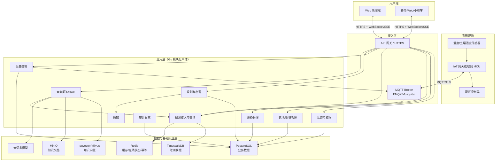
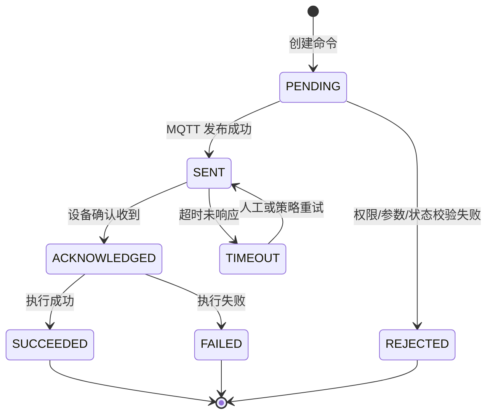
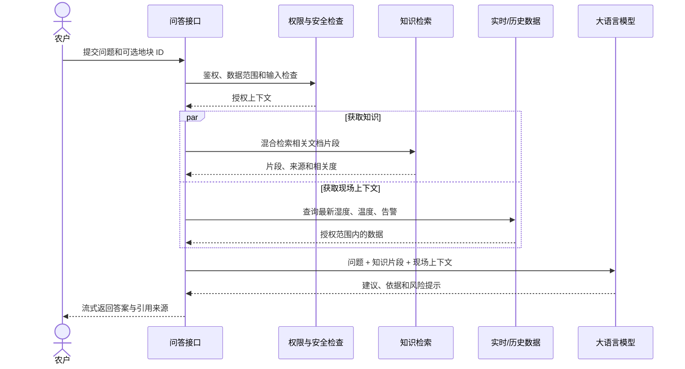
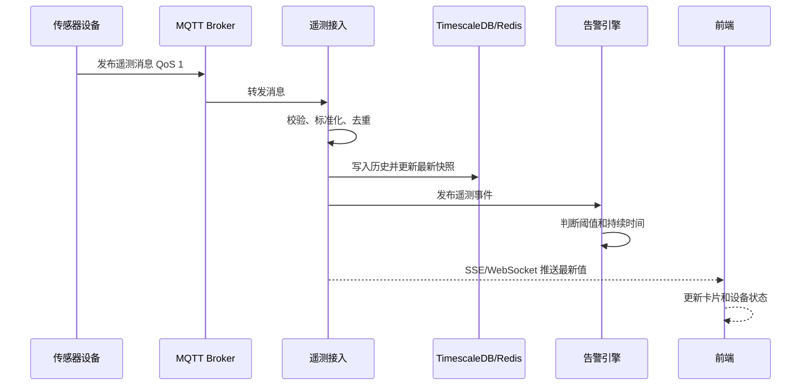
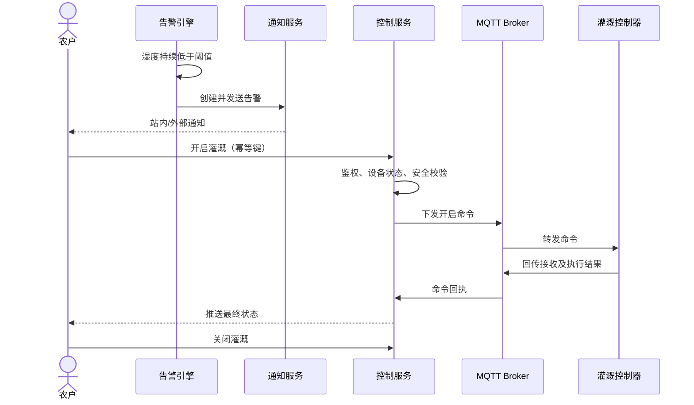
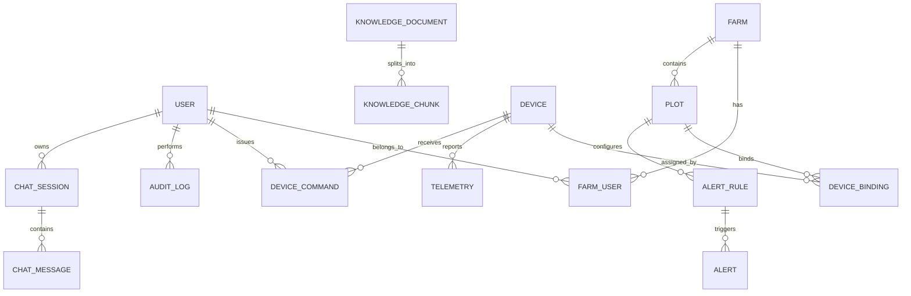
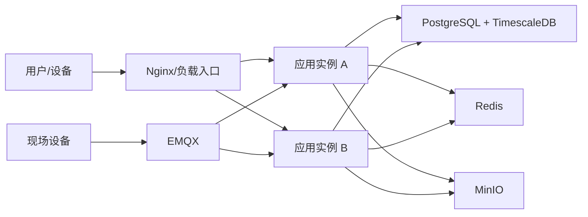

# 智慧农业系统架构设计

> 文档版本：V1.0
> 文档状态：初稿
> 适用范围：温室大棚环境监测、告警、远程灌溉、设备管理与灌溉智能问答
> 架构原则：模块化单体起步、事件驱动解耦、核心链路可追踪、关键控制可审计

## 1. 文档目的

本文档根据智慧农业基本功能清单，定义系统的总体架构、模块边界、核心数据模型、接口与 MQTT 协议、安全策略、部署方案及迭代计划，为产品设计、前后端开发、物联网设备接入、测试和运维提供统一依据。

## 2. 业务目标与范围

### 2.1 建设目标

1. 实时采集并展示地块的土壤湿度、环境温度和设备在线状态。
2. 提供最近 7 天历史趋势查询及多地块统一总览。
3. 支持远程开启、关闭灌溉，并可靠反馈指令执行结果。
4. 支持土壤湿度阈值配置、自动判断、告警通知与日志追溯。
5. 支持设备注册、绑定、解绑和在线状态维护。
6. 基于农业知识库和实时业务数据提供可解释的灌溉建议。

### 2.2 首期范围

| 编号 | 模块 | 功能 | 优先级 |
|---|---|---|---|
| 1-1 | 数据监测 | 查看土壤湿度 | P0 |
| 1-2 | 数据监测 | 查看温度 | P0 |
| 1-3 | 数据监测 | 设备状态监控 | P0 |
| 2-1 | 告警管理 | 土壤湿度阈值告警 | P0 |
| 2-2 | 告警管理 | 告警日志查看 | P1 |
| 3-1 | 设备控制 | 灌溉开关控制 | P0 |
| 4-1 | 数据可视化 | 最近 7 天历史趋势 | P1 |
| 4-2 | 数据可视化 | 多地块总览 | P1 |
| 5-1 | 系统管理 | 设备绑定管理 | P1 |
| 6-1 | 智能体 | 灌溉智能问答 | P2 |

### 2.3 暂不纳入首期

- 根据阈值直接全自动开启灌溉；首期仅告警并由农户确认操作。
- 作物病虫害图像识别、气象预测、施肥控制和农产品溯源。
- 复杂工作流编排、多级审批及跨农场数据交易。

## 3. 架构设计原则

- **业务安全优先**：设备控制必须鉴权、审计、幂等、超时并可确认最终状态。
- **读写分离思路**：实时状态与历史时序数据采用不同的访问方式，兼顾低延迟与统计查询。
- **事件驱动解耦**：遥测上报、状态变更、告警判断和通知通过事件解耦。
- **渐进式演进**：首期采用 Go 模块化单体，按领域划分边界；规模增长后可独立拆出数据接入、告警和智能体服务。
- **租户与权限隔离**：以农场为租户边界，以地块和设备为数据权限边界。
- **可观测和可追溯**：遥测、命令、告警和问答均保留关联标识与审计记录。
- **智能体只建议、不越权**：RAG 可读取授权数据并生成建议，但不得绕过控制接口直接操作设备。

## 4. 总体架构



### 4.1 推荐技术栈

| 层次 | 推荐方案 | 说明 |
|---|---|---|
| 前端 | Vue 3 + TypeScript + Vite + ECharts | 适合管理端、实时卡片和趋势图 |
| 后端 | Go + Gin/Kratos + REST | 首期模块化单体，统一工程与部署 |
| 实时推送 | WebSocket 或 SSE | 首期仅服务端推送时优先 SSE |
| 设备协议 | MQTT 3.1.1/5.0 over TLS | 遥测上报、命令下发和回执 |
| MQTT Broker | EMQX | 支持认证、ACL、规则和集群扩展 |
| 业务数据库 | PostgreSQL | 用户、农场、设备、告警、命令、审计数据 |
| 时序数据 | TimescaleDB（PostgreSQL 扩展） | 降低首期运维复杂度，支持时间分区和聚合 |
| 缓存 | Redis | 实时快照、设备在线状态、幂等键和限流 |
| RAG | MinIO + pgvector；规模扩大后可换 Milvus | 保存原文、切片和向量索引 |
| 可观测性 | OpenTelemetry + Prometheus + Grafana + Loki | 指标、链路与日志统一关联 |
| 部署 | Docker Compose（开发/试点），Kubernetes（规模化） | 按业务规模渐进演进 |

## 5. 系统模块设计

### 5.1 认证与权限模块

职责：用户登录、令牌签发、角色授权、资源级数据权限和登录审计。

- 角色：农户、农场管理员、系统管理员。
- 权限模型：RBAC 控制功能权限，农场/地块绑定控制数据范围。
- 访问令牌采用短期 JWT，刷新令牌可撤销并保存在服务端。
- 系统管理员默认可查看系统运营数据，但敏感操作仍需审计。

| 操作 | 农户 | 农场管理员 | 系统管理员 |
|---|---:|---:|---:|
| 查看授权地块实时/历史数据 | 是 | 是 | 是 |
| 控制授权地块灌溉设备 | 是 | 是 | 按授权 |
| 设置授权地块告警阈值 | 是 | 是 | 按授权 |
| 查看农场所有地块 | 否 | 是 | 是 |
| 绑定/解绑设备 | 否 | 是 | 是 |
| 查看全系统告警与审计 | 否 | 否 | 是 |

### 5.2 农场与地块模块

职责：维护农场、地块、作物及用户归属关系，为数据隔离和智能建议提供上下文。

- 一个农场包含多个地块。
- 一个地块可绑定多个传感器和执行器。
- 地块可维护作物类型、生长阶段、面积和位置等可选信息。

### 5.3 设备管理模块

职责：设备注册、身份认证、绑定/解绑、心跳维护、固件信息和状态展示。

- 每台设备分配唯一 `device_id` 和独立凭据，不共享生产密钥。
- 设备首次激活后才能绑定地块；解绑不删除历史数据。
- 在线状态依据 MQTT 连接事件和心跳共同判断。
- 建议离线判定：连续 3 个心跳周期未收到消息，或 Broker 上报断开事件。

设备状态包括：`UNACTIVATED`、`ONLINE`、`OFFLINE`、`FAULT`、`DISABLED`。

### 5.4 遥测接入与查询模块

职责：消费 MQTT 遥测消息，完成协议校验、去重、标准化、持久化、实时快照更新和前端推送。

处理步骤：

1. 校验设备身份、主题权限、消息格式、时间戳和数值范围。
2. 使用 `device_id + message_id` 去重。
3. 将标准化遥测数据批量写入 TimescaleDB。
4. 更新 Redis 中设备与地块的最新数据快照。
5. 发布内部“遥测已接收”事件，触发告警判断。
6. 向已订阅该地块的前端会话推送最新值。

### 5.5 设备控制模块

职责：接收控制请求、校验权限与设备状态、创建命令、MQTT 下发、等待回执并记录最终结果。

命令状态机：



控制约束：

- 每个请求必须携带客户端幂等键，防止重复点击导致重复执行。
- 同一设备的控制命令串行执行，避免开、关指令乱序。
- 设备离线时默认拒绝实时控制，不将危险命令无限期排队。
- 命令超时只表示“结果未知”，页面需提示用户核对实际设备状态。
- 灌溉可配置单次最长开启时长；超时由设备侧安全关闭，服务端辅助兜底。

### 5.6 规则与告警模块

职责：保存阈值规则、处理遥测事件、生成告警、恢复告警、通知用户和支持历史追溯。

为防止临界值抖动造成告警风暴，采用持续时间和回差：

- 触发条件示例：土壤湿度 `< 30%` 且持续 2 分钟。
- 恢复条件示例：土壤湿度 `>= 33%` 且持续 2 分钟。
- 同一规则存在未恢复告警时不重复创建，仅更新最近发生时间。
- 通知失败进入重试队列，但不影响告警记录生成。

告警状态：`ACTIVE`、`ACKNOWLEDGED`、`RESOLVED`、`CLOSED`。

### 5.7 通知模块

职责：按用户偏好通过站内消息、短信、邮件或小程序模板消息发送告警。

首期建议实现站内消息；短信等外部渠道通过统一适配器扩展。通知模板、渠道、发送结果和失败原因需持久化。

### 5.8 数据可视化模块

- 实时页从 Redis 快照获取首屏数据，再通过 SSE/WebSocket 接收增量更新。
- 历史趋势默认查询最近 7 天，并根据时间跨度执行降采样。
- 多地块总览返回每个地块的最新温度、湿度、设备状态和活动告警数。
- 所有时间在服务端以 UTC 保存，接口按用户时区格式化或返回带时区时间。

### 5.9 智能问答与 RAG 模块

职责：对农业知识文档进行解析、切片、向量化和检索，结合用户有权访问的地块实时数据生成灌溉建议。



安全边界：

- 检索前按农场/知识库权限过滤，防止跨租户数据泄漏。
- 回答明确区分知识库事实、实时数据和模型推断。
- 给出知识来源和数据采样时间；数据过期时主动提示。
- 智能体不能直接发布 MQTT 指令；如用户要求灌溉，仅生成待确认操作，由正式控制接口执行。
- 记录问题、引用、模型版本、耗时和安全拦截结果；敏感字段脱敏。

## 6. 核心业务流程

### 6.1 遥测上报与实时展示



### 6.2 阈值告警与人工灌溉



## 7. 数据架构

### 7.1 核心实体关系



### 7.2 主要数据表

| 表名 | 关键字段 | 用途 |
|---|---|---|
| `users` | id, name, mobile, status | 用户账户 |
| `roles`, `user_roles` | role_code, user_id | 角色授权 |
| `farms` | id, name, owner_id | 农场租户边界 |
| `farm_users` | farm_id, user_id, farm_role | 用户与农场关系 |
| `plots` | id, farm_id, name, crop_type, area | 地块信息 |
| `devices` | id, serial_no, type, status, last_seen_at | 设备主数据 |
| `device_bindings` | device_id, plot_id, bound_at, unbound_at | 保留历史的绑定关系 |
| `telemetry` | time, device_id, plot_id, metric, value, quality, message_id | 时序遥测数据 |
| `device_latest` | device_id, metric, value, sampled_at | 最新快照，可由 Redis 加速 |
| `alert_rules` | id, plot_id, metric, operator, threshold, duration, hysteresis | 阈值规则 |
| `alerts` | id, rule_id, level, status, triggered_at, resolved_at | 告警实例 |
| `device_commands` | id, device_id, action, status, idempotency_key, expires_at | 控制命令与结果 |
| `notifications` | id, alert_id, user_id, channel, status | 通知记录 |
| `audit_logs` | id, actor_id, action, resource, result, trace_id, created_at | 操作审计 |
| `knowledge_documents` | id, title, version, source, status | 知识文档元数据 |
| `knowledge_chunks` | id, document_id, content, embedding, metadata | RAG 检索切片 |
| `chat_sessions`, `chat_messages` | user_id, question, answer, citations | 智能问答记录 |

### 7.3 时序数据策略

- 唯一约束建议为 `(device_id, message_id)`，设备重传时保证幂等。
- 按时间自动分区，常用索引为 `(plot_id, metric, time DESC)` 和 `(device_id, time DESC)`。
- 原始数据保留期建议 90 天；5 分钟聚合保留 1 年；日聚合按业务要求长期保留。
- 趋势接口根据跨度选择原始、5 分钟或日聚合数据，避免一次返回大量点位。
- 原始数据保留期和聚合粒度必须配置化，不在代码中硬编码。

## 8. 接口设计

### 8.1 REST API

统一前缀：`/api/v1`。成功与错误响应均包含 `request_id`，时间字段使用 ISO 8601。

| 方法 | 路径 | 说明 | 权限 |
|---|---|---|---|
| `POST` | `/auth/login` | 登录 | 公开 |
| `GET` | `/farms/{farmId}/overview` | 多地块总览 | 农场成员 |
| `GET` | `/plots/{plotId}/telemetry/latest` | 地块最新温湿度 | 地块成员 |
| `GET` | `/plots/{plotId}/telemetry/history` | 历史趋势，支持指标和时间范围 | 地块成员 |
| `GET` | `/devices/{deviceId}` | 设备详情及在线状态 | 设备所属农场成员 |
| `POST` | `/devices/{deviceId}/commands` | 下发灌溉控制命令 | 农户/农场管理员 |
| `GET` | `/commands/{commandId}` | 查询命令状态 | 命令所属农场成员 |
| `PUT` | `/plots/{plotId}/alert-rules/{ruleId}` | 设置阈值规则 | 农户/农场管理员 |
| `GET` | `/farms/{farmId}/alerts` | 查询告警日志 | 按角色和数据范围 |
| `POST` | `/alerts/{alertId}/acknowledge` | 确认告警 | 农场成员 |
| `POST` | `/plots/{plotId}/devices:bind` | 绑定设备 | 农场管理员 |
| `POST` | `/plots/{plotId}/devices:unbind` | 解绑设备 | 农场管理员 |
| `POST` | `/agent/chat` | 智能问答，可流式返回 | 登录用户 |

控制命令请求示例：

```json
{
  "action": "IRRIGATION_ON",
  "duration_seconds": 600,
  "idempotency_key": "b7ce1655-3bf8-4da8-b8f6-2f11c50afed3"
}
```

响应采用 `202 Accepted`，表示命令已受理而非设备已经执行：

```json
{
  "command_id": "cmd_01J...",
  "status": "PENDING",
  "request_id": "req_01J..."
}
```

### 8.2 实时推送

推荐端点：`GET /api/v1/events?farm_id={farmId}`。

事件类型：

- `telemetry.updated`
- `device.status_changed`
- `alert.triggered`
- `alert.resolved`
- `command.status_changed`

服务端仅推送当前用户有权访问的资源；客户端断线重连后应重新拉取最新快照，不依赖推送补齐全部历史事件。

## 9. MQTT 协议设计

### 9.1 Topic 约定

| 方向 | Topic | QoS | 说明 |
|---|---|---:|---|
| 设备→平台 | `agri/v1/devices/{deviceId}/telemetry` | 1 | 遥测数据 |
| 设备→平台 | `agri/v1/devices/{deviceId}/heartbeat` | 1 | 心跳与运行状态 |
| 平台→设备 | `agri/v1/devices/{deviceId}/commands` | 1 | 控制命令 |
| 设备→平台 | `agri/v1/devices/{deviceId}/command-acks` | 1 | 命令接收/执行回执 |
| 设备→平台 | `agri/v1/devices/{deviceId}/events` | 1 | 故障、重启等设备事件 |

Broker ACL 必须限制设备只能发布和订阅自身 `deviceId` 对应的 Topic。

### 9.2 遥测消息示例

```json
{
  "schema_version": "1.0",
  "message_id": "01J5X8M8B9J4M8R7AZ8R1R6C3Q",
  "device_id": "dev_10001",
  "timestamp": "2026-08-21T08:00:00Z",
  "metrics": {
    "soil_moisture": { "value": 28.6, "unit": "%", "quality": "GOOD" },
    "temperature": { "value": 26.4, "unit": "C", "quality": "GOOD" }
  }
}
```

### 9.3 命令消息示例

```json
{
  "schema_version": "1.0",
  "command_id": "cmd_01J5X...",
  "action": "IRRIGATION_ON",
  "parameters": { "duration_seconds": 600 },
  "issued_at": "2026-08-21T08:01:00Z",
  "expires_at": "2026-08-21T08:01:30Z"
}
```

### 9.4 命令回执示例

```json
{
  "command_id": "cmd_01J5X...",
  "device_id": "dev_10001",
  "status": "SUCCEEDED",
  "executed_at": "2026-08-21T08:01:02Z",
  "reported_state": { "irrigation": "ON" },
  "error_code": null,
  "error_message": null
}
```

## 10. 非功能需求

### 10.1 性能与容量基线

以下为试点阶段设计基线，实施前应按设备数量和采样频率复核：

| 指标 | 目标 |
|---|---|
| 在线设备数 | 1,000 台，可水平扩展 |
| 遥测写入 | 持续 200 条/秒，峰值 1,000 条/秒 |
| 实时数据端到端延迟 | P95 小于 3 秒 |
| 普通 API 响应 | P95 小于 500 毫秒 |
| 7 天趋势查询 | P95 小于 2 秒，结果降采样 |
| 控制命令平台下发 | P95 小于 1 秒，不含设备执行时间 |
| 核心服务可用性 | 试点期 99.5%，规模化后 99.9% |

### 10.2 可靠性

- MQTT 遥测和命令使用 QoS 1，业务层必须去重。
- 数据库每日全量备份并持续归档 WAL；定期执行恢复演练。
- 命令状态、告警状态采用事务更新，并通过 Outbox 模式可靠发布内部事件。
- 设备网络中断时可在本地缓存有限遥测，恢复后按原采样时间补传。
- 控制器必须具备本地安全策略，不能把人身和财产安全完全依赖于云端。

### 10.3 安全

- Web/API 全链路 HTTPS，MQTT 使用 TLS；生产环境禁用匿名连接。
- 设备采用独立证书或独立密钥，支持轮换、吊销和禁用。
- 密码使用 Argon2id/bcrypt 哈希；敏感配置进入密钥管理系统。
- 所有查询强制携带租户范围，数据库访问层统一注入 `farm_id` 条件。
- 控制、阈值修改、设备绑定和权限修改必须写入不可随意修改的审计日志。
- API 实施限流、防重放、参数校验、依赖漏洞扫描和安全响应头。
- 智能体防护提示注入、越权检索、敏感信息泄漏和不安全工具调用。

### 10.4 可观测性

统一传播 `trace_id`、`request_id`、`message_id` 和 `command_id`。

关键指标：

- MQTT 连接数、消息吞吐、消费延迟、校验失败和重复消息数。
- 遥测写入延迟、数据库慢查询、缓存命中率。
- 在线/离线设备数及心跳超时数。
- 活动告警数、通知成功率和告警处理时长。
- 命令成功率、超时率和端到端执行耗时。
- RAG 检索耗时、模型耗时、引用命中率和安全拦截数。

## 11. 部署架构

### 11.1 试点环境



- 开发和试点可使用 Docker Compose。
- PostgreSQL、Redis、EMQX 和 MinIO 使用持久化卷，备份文件存放在独立介质。
- 应用服务保持无状态，可按吞吐水平扩容。
- 规模扩大后迁移 Kubernetes，并为数据库和 Broker 配置高可用方案。

### 11.2 环境划分

- `dev`：开发联调，可使用设备模拟器。
- `test`：自动化测试和协议兼容测试。
- `staging`：接近生产配置，用于端到端和验收测试。
- `prod`：生产环境，禁止使用测试设备凭据和调试配置。

配置通过环境变量或配置中心注入；密钥不进入代码仓库。

## 12. 代码组织建议

```text
smart-project/
├─ cmd/
│  ├─ api/                 # HTTP/SSE 服务入口
│  ├─ worker/              # MQTT 消费、告警、通知任务
│  └─ migrate/             # 数据库迁移入口
├─ internal/
│  ├─ auth/                # 认证与权限
│  ├─ farm/                # 农场与地块
│  ├─ device/              # 设备和绑定
│  ├─ telemetry/           # 遥测接入与查询
│  ├─ control/             # 设备控制
│  ├─ alert/               # 规则与告警
│  ├─ notification/        # 通知适配
│  ├─ agent/               # RAG 与模型适配
│  ├─ audit/               # 审计
│  └─ platform/            # 数据库、缓存、MQTT、日志等基础设施
├─ api/                    # OpenAPI 与 MQTT Schema
├─ migrations/             # 数据库迁移
├─ web/                    # 前端工程
├─ deployments/            # Compose/Kubernetes 配置
├─ test/                   # 集成与端到端测试
└─ docs/                   # 架构、协议与运维文档
```

领域模块通过应用接口协作，禁止跨模块直接访问对方的数据表。首期可同进程部署，但保持边界清晰，为后续拆分服务保留条件。

## 13. 测试策略

- **单元测试**：阈值和回差判断、权限范围、命令状态机、数据校验、RAG 上下文组装。
- **契约测试**：OpenAPI、MQTT Schema、设备固件与平台消息兼容性。
- **集成测试**：PostgreSQL、Redis、EMQX、对象存储和模型适配器。
- **端到端测试**：传感器上报→页面展示；低湿告警→通知；控制下发→回执→页面状态。
- **异常测试**：设备离线、消息重复/乱序、回执丢失、Broker 重连、数据库短暂不可用。
- **性能测试**：批量设备连接、峰值遥测写入、多地块看板并发和 7 天趋势查询。
- **安全测试**：跨农场越权、Topic 越权、重放命令、提示注入和敏感数据泄漏。

## 14. 迭代实施建议

### 阶段一：设备接入与监测闭环（P0）

- 建立用户、农场、地块和设备基础模型。
- 完成 MQTT 设备认证、遥测接入、最新值和在线状态。
- 完成实时监测页面和设备模拟器。
- 验收标准：真实或模拟设备数据可在 3 秒内稳定展示，断线状态可正确识别。

### 阶段二：告警与控制闭环（P0）

- 完成阈值规则、持续时间、回差、告警日志和站内通知。
- 完成灌溉开关命令、回执、幂等、超时和审计。
- 验收标准：低湿告警可追溯；控制结果与设备真实状态一致，异常状态有明确提示。

### 阶段三：运营管理与趋势分析（P1）

- 完成 7 天趋势、多地块总览和设备绑定管理。
- 完成时序聚合、保留策略、备份恢复和监控告警。
- 验收标准：数据权限隔离有效，趋势查询达到性能基线。

### 阶段四：智能问答（P2）

- 建立知识文档入库、切片、向量化、混合检索和引用机制。
- 接入地块实时上下文，建立评测集和安全防护。
- 验收标准：回答带来源和数据时间；不越权、不自动控制设备；核心问题通过人工评测。

## 15. 架构决策记录

| 决策 | 选择 | 原因 | 后续演进条件 |
|---|---|---|---|
| 服务形态 | 模块化单体 | 首期团队和业务规模有限，降低分布式复杂度 | 单模块吞吐、发布频率或团队边界显著独立时拆分 |
| 时序存储 | TimescaleDB | 复用 PostgreSQL 生态，事务与运维成本较低 | 超大规模写入或分析需求出现时评估专用时序库 |
| 实时推送 | SSE 优先 | 当前主要是服务端到客户端单向推送 | 需要大量双向实时交互时使用 WebSocket |
| 告警后动作 | 人工确认灌溉 | 避免误报直接造成设备动作和农业损失 | 设备可靠性、规则评估和安全联锁成熟后开放自动策略 |
| 向量数据库 | pgvector 起步 | 减少首期组件数量 | 向量规模、检索吞吐或混合检索能力不足时迁移 Milvus |
| 智能体权限 | 只读数据、不给设备直控权 | 将模型不确定性与物理控制隔离 | 不建议取消人工确认；可引入受控工作流审批 |

## 16. 风险与待确认事项

| 风险/待确认项 | 影响 | 建议 |
|---|---|---|
| 设备型号和网络制式尚未明确 | 影响协议、心跳、离线缓存与升级方案 | 尽早确定硬件能力并开展协议联调 |
| 采样频率和设备规模尚未明确 | 影响数据库容量与 Broker 规格 | 用“设备数 × 指标数 × 上报频率”完成容量测算 |
| 告警通知渠道尚未确定 | 影响第三方费用、模板审核和到达率 | 首期站内通知，外部渠道做适配器 |
| 阈值由谁配置、是否需要模板尚未明确 | 影响权限和规则模型 | 定义农户可调范围及管理员推荐模板 |
| 灌溉设备安全联锁能力未知 | 影响远程控制安全 | 必须具备本地超时关闭和手动控制优先级 |
| 农业知识来源和版权边界未明确 | 影响 RAG 质量与合规 | 建立来源、版本、授权和审核流程 |
| 数据保留与隐私要求未明确 | 影响存储成本与合规 | 上线前确认保留期、脱敏和删除策略 |

## 17. 验收追踪矩阵

| 用户故事 | 架构承载模块 | 关键验收点 |
|---|---|---|
| 查看土壤湿度/温度 | 遥测接入、时序存储、实时推送 | 数值、单位、采样时间、质量和设备状态正确 |
| 查看历史趋势 | 时序查询、连续聚合、ECharts | 7 天数据准确，缺失点可识别，响应满足基线 |
| 远程控制灌溉 | 控制服务、MQTT、命令状态机、审计 | 幂等、超时、回执和最终状态完整 |
| 设置湿度阈值 | 规则引擎、告警、通知 | 持续时间和回差有效，无重复告警风暴 |
| 查看设备状态 | 心跳、Broker 事件、Redis 快照 | 在线/离线判断及时且可解释 |
| 灌溉智能问答 | RAG、业务数据工具、LLM 安全层 | 有引用、有数据时间、不越权、不直接控制 |
| 多地块总览 | 农场/地块、聚合查询、缓存 | 仅展示授权地块，状态和告警数准确 |
| 设备绑定管理 | 设备、绑定关系、权限、审计 | 新增/解绑可追溯，历史数据不丢失 |
| 查看告警日志 | 告警查询、RBAC、审计 | 支持按时间、状态、地块筛选并正确隔离数据 |

---

本架构以首期可交付为目标。进入详细设计前，应优先确认设备协议、目标设备规模、采样频率、控制器安全能力和告警通知渠道，并据此完成容量评估、接口 Schema 和数据库物理设计。
